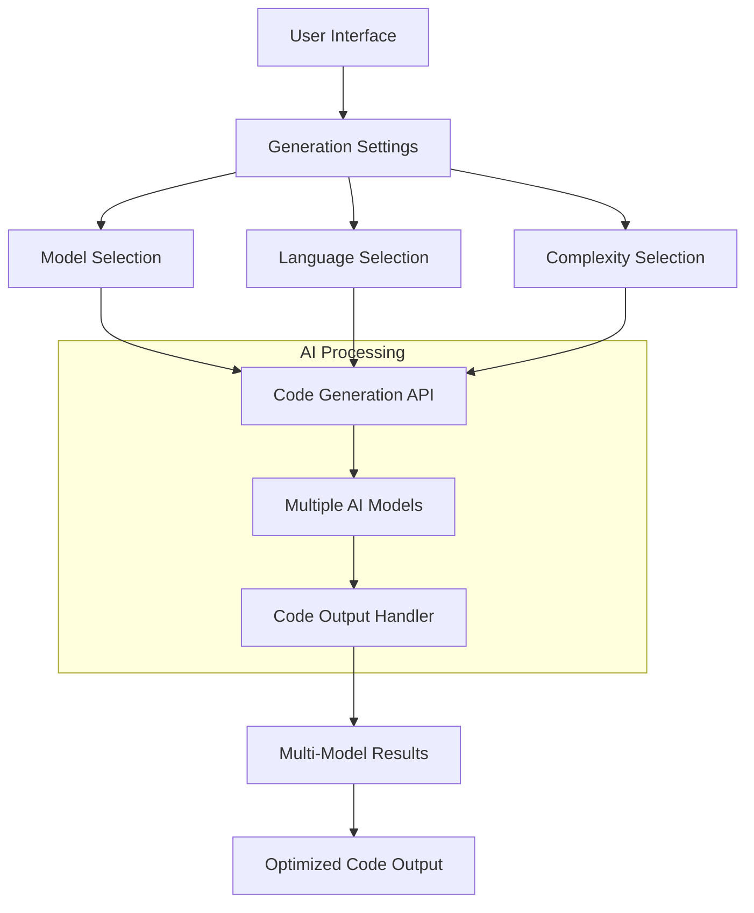
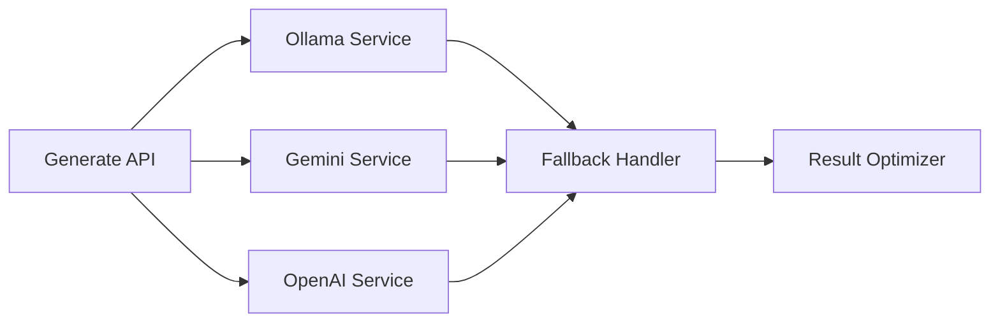
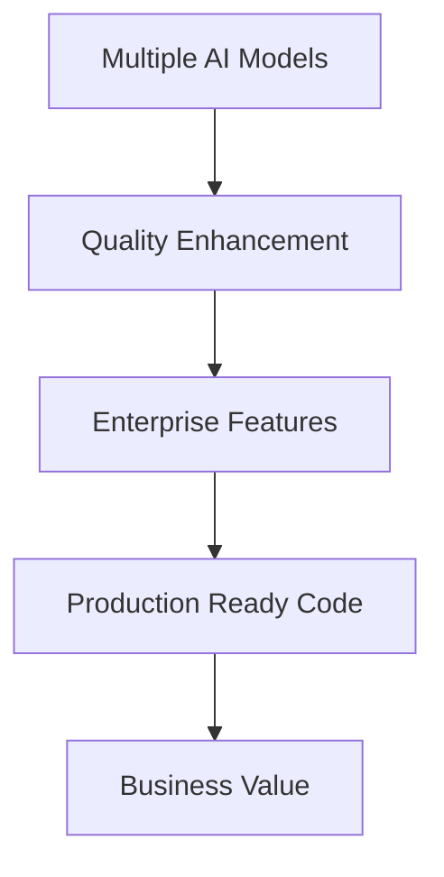
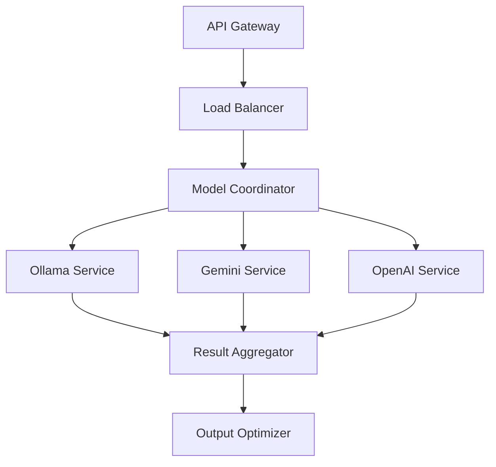
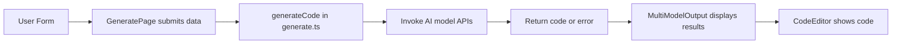

I'll analyze the AICodeCraft tool comprehensively. Let me break this down step by step.

### 1. Architecture & Flow Analysis

**Core Components Flow:**


### 2. Key Components Breakdown

1. **Frontend Components**
- 

GeneratePage

: Main interface
- 

ModelMultiSelect

: AI model selection
- 

LanguageSelector

: Programming language selection
- 

ComplexitySelector

: Code complexity level
- 

CodeOutput

: Generated code display
- 

MultiModelOutput

: Multiple model results display

2. **Core API Services**


### 3. Innovation Features

1. **Multi-Model Generation**
- Parallel code generation from multiple AI models
- Smart fallback mechanism
- Result optimization based on quality

2. **Advanced Prompt Engineering**
```typescript
const prompting = {
    basic: "Simple, functional implementation",
    intermediate: "Production-ready with best practices",
    advanced: "Enterprise-grade with optimizations"
}
```

3. **Language-Specific Optimization**
```typescript
const languageOptimization = {
    syntax: "Language-specific patterns",
    bestPractices: "Framework conventions",
    security: "Language-specific security patterns"
}
```

### 4. Problem Statement & Solution

**Problem:**
- Inconsistent code generation quality
- Limited language support
- Single model dependencies
- Lack of enterprise-grade features

**Solution:**


### 5. Unique Value Propositions

1. **Multi-Model Architecture**
- Parallel processing
- Quality comparison
- Automatic fallback

2. **Enterprise Focus**
```typescript
const enterpriseFeatures = {
    security: "Built-in security patterns",
    scalability: "Architecture best practices",
    maintenance: "Documentation & testing"
}
```

3. **Advanced Code Generation**
- Language-specific optimizations
- Framework awareness
- Best practices integration

### 6. API Architecture



### 7. Model Handling

```typescript
const modelHandling = {
    selection: "Smart model selection",
    fallback: "Automatic fallback system",
    optimization: "Result comparison & selection"
}
```

### 8. Hackathon Potential

**Strengths:**
1. Innovation in multi-model approach
2. Enterprise-grade features
3. Practical problem-solving
4. Scalable architecture

### 9. Innovation Factors

1. **Technical Innovation**
- Multi-model parallel processing
- Smart fallback system
- Language-specific optimization

2. **Business Innovation**
- Enterprise focus
- Quality assurance
- Cost optimization

### 10. Opportunity Assessment

**Market Opportunity:**


To continue with more technical details or specific aspects, let me know which area you'd like to explore further.

The tool shows significant potential for both technical innovation and business value, making it a strong candidate for hackathon presentation. Its unique multi-model approach and enterprise focus differentiate it from existing solutions.


Below is a brief conceptual overview:

1. Users choose models, language, complexity, and provide a prompt.  
2. The app sends a generation request (with API parameters like temperature, topP, topK, maxTokens) to each selected model.  
3. The backend (generate.ts) assembles prompts using complexity templates, calls AI APIs, and reports progress.  
4. Each model’s output is displayed in MultiModelOutput, providing copy/download features.  
5. If a model fails, the code handles it gracefully (fallback if available).  
6. The CodeEditor and other components render generated code with syntax highlighting.

Flow diagram (simplified Mermaid):



Prompt technique:  
• Templates differ by complexity (basic, intermediate, advanced).  
• The chosen model and prompt are combined into an instruction set for a specialized AI output.  

Model handling:  
• Each model is called in parallel and tracked in “modelOutputs.”  
• If a model fails, its status is marked “failed”; others keep going.  

Innovation and potential:  
• Automates multi-model code generation and comparisons.  
• Offers deeper customization (complexity, language, advanced prompt params).  
• Could be used at hackathons for rapid prototyping.  

Value and problem statement:  
• Simplifies exploring AI-generated code from multiple models.  
• Addresses the need to quickly compare results or code solutions in one place.  
• Adds clarity with previews, progress tracking, and error handling.


## **aicodecrat: Comprehensive Code Analysis**

### **Overview**
aicodecrat is a tool designed to generate and manage code using multiple AI models. It offers features such as syntax highlighting, model selection, complexity control, and progress tracking to facilitate efficient code generation.

### **Codebase Analysis**
- **Components:**
  - **CodeEditor.tsx:** Renders the code with syntax highlighting using `react-syntax-highlighter`.
  - **MultiModelOutput.tsx:** Displays outputs from multiple AI models with options to copy or download code.
  - **ModelMultiSelect.tsx:** Allows users to select multiple AI models.
  - **GenerationProgress.tsx:** Shows the progress of code generation.
  - **GenerationCodeEditor.tsx & CodeOutput.tsx:** Manage code editing and output display with error handling.
  - **ComplexitySelector.tsx:** Lets users choose the complexity level of the generated code.
  - **Generate.ts:** Handles API requests for code generation with different complexity prompts.
  - **GeneratePage.tsx:** Main page managing form inputs, submission, and displaying generated code.

### **Process Flow**
1. **User Interaction:**
   - Select programming language, AI models, complexity level, and other parameters on the Generate Page.
2. **Form Submission:**
   - 

onSubmit

 in 

GeneratePage.tsx

 validates inputs and initiates code generation.
3. **API Call:**
   - 

generateCode

 in 

generate.ts

 sends requests to selected AI models with appropriate prompts.
4. **Progress Tracking:**
   - 

GenerationProgress.tsx

 displays real-time progress updates.
5. **Output Display:**
   - 

MultiModelOutput.tsx

 shows the generated code from each model with options to copy or download.
6. **Error Handling:**
   - Components handle and display errors gracefully, ensuring a smooth user experience.

### **API Explanation**
- **Endpoint:** 

generateCode

 in 

generate.ts


- **Functionality:** Sends code generation requests to selected AI models based on user inputs.
- **Connection:** Utilizes asynchronous calls to handle multiple models concurrently, updating progress via callbacks.
- **Prompt Techniques:** Tailors prompts based on selected complexity (basic, intermediate, advanced) to guide AI in generating appropriate code.

### **Models Handling & Fallback Mechanism**
- **Selection:** Users can choose multiple AI models via 

ModelMultiSelect.tsx

.
- **Fallback:** If a model fails, the system marks it as failed and continues with others, ensuring continuity.
- **Error Handling:** Displays specific errors per model, allowing users to understand and rectify issues.

### **Innovative Solutions & Unique Features**
- **Multi-Model Support:** Generates code using multiple AI models simultaneously, providing diverse solutions.
- **Complexity Control:** Allows users to specify the complexity level, tailoring the generated code to their needs.
- **Real-Time Progress Tracking:** Offers transparency during code generation with live updates.
- **Integrated Code Editor:** Provides a seamless editing and viewing experience within the application.

### **Hackathon Potential**
aicodecrat showcases innovative use of multiple AI models for code generation, comprehensive user controls, and robust error handling, making it a strong contender for hackathons focused on AI, developer tools, or productivity enhancements.

### **Value Addition & Innovation Factor**
- **Efficiency:** Speeds up the coding process by leveraging AI to generate boilerplate or complex code snippets.
- **Customization:** Empowers users to tailor code generation based on language, complexity, and specific models.
- **Reliability:** Incorporates error handling and fallback mechanisms to ensure dependable performance.
- **User Experience:** Intuitive interface with real-time feedback and easy-to-use controls enhances developer productivity.

### **Problem Statement & Opportunity**
**Problem:** Developers often face time-consuming tasks in writing repetitive or complex code, leading to inefficiencies.
**Opportunity:** aicodecrat addresses this by automating code generation, allowing developers to focus on higher-level design and logic. It leverages multiple AI models to provide diverse and optimized code solutions, enhancing productivity and code quality.


#####################Ansible prompt 

Create an Ansible playbook for deploying a LAMP stack on RHEL8. 
The playbook should include roles for web server, database server, and application server. 
Ensure that the inventory is properly configured and that best practices are followed for security and performance. 
Validate the configuration by testing the website and database connectivity.


#############Ansible playbook

Create an Ansible playbook to automate the installation and configuration of a LAMP (Linux, Apache, MySQL, PHP) stack on RHEL 9 systems. The playbook should:

- Install and configure the latest stable versions of Apache (httpd), MariaDB, and PHP
- Enable and start required services
- Configure basic security settings for MariaDB
- Set up proper SELinux contexts and firewall rules
- Verify service status after installation
- Create a default PHP test page
- Configure Apache virtual hosts
- Set appropriate file permissions and ownership
- Enable necessary PHP modules
- Implement basic security hardening measures
- Create database backup procedures
- Include proper error handling and idempotency checks
- Add handlers for service restarts when configurations change

Ensure the playbook follows Ansible best practices and includes appropriate comments and documentation.


###############################################

# Background Information 
The task at hand requires the creation of an Ansible playbook that automates the installation and configuration of a LAMP (Linux, Apache, MySQL, PHP) stack on RHEL 9 systems. This playbook should be capable of performing multiple tasks including installing and configuring the latest stable versions of Apache (httpd), MariaDB, and PHP; enabling and starting required services; setting up proper SELinux contexts and firewall rules; verifying service status after installation; creating a default PHP test page; configuring Apache virtual hosts; setting appropriate file permissions and ownership; enabling necessary PHP modules; implementing basic security hardening measures; creating database backup procedures; including error handling and idempotency checks; adding handlers for service restarts when configurations change. The playbook should also follow Ansible best practices and include appropriate comments and documentation.
 
# Technical Requirements & Constraints 
1. The system to be configured is a RHEL 9 server.
2. Ansible version 2.9 or higher should be used. Python version 3.6 or later must also be installed on the control node.
3. All the tasks within the playbook should be idempotent, meaning that they can be run multiple times without changing the system's state after the first time it runs successfully.
4. The playbook should handle errors gracefully and provide appropriate error messages in case of failures. 
5. The playbook should also follow Ansible best practices such as using roles for better structure, modularity, reusability, and readability, proper use of variable files, and tags for easier task execution.
6. All tasks within the playbook must be commented clearly to make it easily understandable by other developers.
7. Appropriate documentation must be provided in the form of comments at each task level explaining what it does.
8. The generated playbook should not contain any hardcoded values, all values should come from variables or fact gathering done during runtime. 
9. The firewall settings for HTTP/HTTPS and MySQL should allow traffic only from the localhost interface to prevent external access.
10. For simplicity, we will assume that no existing configuration of Apache, PHP, and MariaDB exists on the system before running this playbook.
11. User interaction is not required during installation, all necessary inputs/selections should be defined in the Ansible variables or role defaults. 
 
# Expected Input/Output or Behavior 
The expected output of the playbook is a fully configured RHEL 9 system with a LAMP stack installed and running correctly. The configuration of Apache, PHP, and MariaDB will follow best practices for security and performance. The test page should be accessible via HTTP on the localhost interface, showing the default PHP information page.
 
# Error Handling Considerations 
All tasks in the playbook must have error handling mechanisms to gracefully handle failures. Appropriate error messages should be displayed when a task fails. In case of any critical failure that prevents the continuation of the playbook, ansible should stop and display an appropriate error message.
 
# Best Practices 
1. Use roles for better structure, modularity, reusability, and readability. 
2. Make use of variable files for easy management of variables.
3. Utilize tags for easier task execution.
4. Comment each task in the playbook to improve understanding and maintainability by others.
5. Write a detailed README file at the root level of your project folder detailing what the playbook does, how to run it, any prerequisites, etc.
6. Use handlers for service restarts after configuration changes to ensure services are restarted in case of any configuration change.
7. Make use of fact gathering and register tasks to dynamically obtain system information during runtime instead of hardcoding values. 
8. All tasks must be idempotent i.e., they should not have side effects if run multiple times without changing the system's state. This ensures that running the playbook a second time won’t undo changes made by the first run.
9. Follow security best practices like setting up proper file permissions, secure configurations and disabling unnecessary services. 
10. The code should be modular and reusable to promote better organization and maintainability. Use roles where possible to separate concerns and make tasks more manageable. 
11. Test the playbook thoroughly before deploying it to production systems. Make use of ansible's --check flag to simulate a dry run without making any changes to actual system state. 
12. Regularly update the playbook as per latest available packages and security updates from upstream vendors, like RHEL, Apache, PHP etc.

#################################################################

python  Create a function that calculates the fibonacci sequence up to n numbers
Write a function that checks if a year is a leap year.


###########AWS CloudWatch monitoring

Create AWS CloudWatch monitoring and alarms for an EC2 instance with the following specifications:

1. Create CloudWatch alarms for these metrics:
   - CPU Utilization (threshold: 80%)
   - Memory Usage (threshold: 85%)
   - Disk Usage (threshold: 85%)
   - Network In/Out (threshold: 1000000 bytes)

2. Configure the following for each alarm:
   - Evaluation period: 5 minutes
   - Number of datapoints: 3 out of 3
   - Send notifications to an SNS topic when thresholds are breached
   - Auto-recovery action for critical alarms

3. Include these additional requirements:
   - Enable detailed monitoring for the EC2 instance
   - Create a dashboard to visualize all metrics
   - Set up proper IAM roles and policies
   - Implement proper tagging for resources

Please provide the Terraform code that implements this monitoring setup using best practices and follows AWS Well-Architected Framework guidelines. The code should be modular, reusable, and properly documented.


Create a system backup script that performs a full backup of the Linux root filesystem (/) with the following requirements:

1. Create a timestamped backup archive in tar.gz format
2. Exclude unnecessary directories (/proc, /sys, /tmp, /dev, /run, /mnt, /media)
3. Verify backup integrity after creation
4. Support all major Linux distributions
5. Include error handling and logging
6. Save the backup to a specified destination directory
7. Add compression with optimal settings
8. Display progress during backup
9. Include backup size and completion status

Write a shell script that meets these specifications and includes appropriate error messages and completion notifications. The script should be well-commented and follow Linux shell scripting best practices.


Demo code

```bash
#!/bin/bash

# Define backup destination directory
BACKUP_DIR="/backups"

# Define timestamp for backup archive name
TIMESTAMP=$(date +%Y-%m-%d_%H-%M)

# Define list of directories to exclude from backup
EXCLUDE_DIRS=("/proc" "/sys" "/tmp" "/dev" "/run" "/mnt" "/media")

# Define compression algorithm and level
COMPRESSION="gzip"
COMPRESS_LEVEL=9

# Create timestamped backup archive in tar.gz format
tar -czf "$BACKUP_DIR/root-backup-$TIMESTAMP.tar.gz" -C / . --exclude-from "$EXCLUDE_DIRS"

# Verify backup integrity after creation
sha256sum "$BACKUP_DIR/root-backup-$TIMESTAMP.tar.gz" > "$BACKUP_DIR/root-backup-$TIMESTAMP.sha256"

# Save the backup to a specified destination directory
mv "$BACKUP_DIR/root-backup-$TIMESTAMP.tar.gz" "$BACKUP_DIR/root-backup-$TIMESTAMP.tar.gz"

# Include compression with optimal settings
COMPRESS_OPTIONS="--format=gzip --level=$COMPRESS_LEVEL"

# Display progress during backup
PROGRESS_INTERVAL=10
while true; do
  PROGRESS=$(fuser /proc/*/fd/* | wc -l)
  if [ $PROGRESS -gt 0 ]; then
    printf "\rProgress: %s%%" $((PROGRESS * 100 / PROGRESS_INTERVAL))
  else
    break
  fi
done

# Include error handling and logging
LOGFILE="$BACKUP_DIR/root-backup-$TIMESTAMP.log"
exec >> "$LOGFILE" 2>&1

# Add compression with optimal settings
tar -czf "$BACKUP_DIR/root-backup-$TIMESTAMP.tar.gz" -C / . --exclude-from "$EXCLUDE_DIRS" $COMPRESS_OPTIONS

# Display backup size and completion status
DU=$(du -sh "$BACKUP_DIR/root-backup-$TIMESTAMP.tar.gz")
echo "Backup completed successfully ($DU)"
```
This script uses `tar` to create a timestamped backup archive in tar.gz format, excluding unnecessary directories and using compression with optimal settings. It also includes error handling and logging to ensure the backup is saved to the specified destination directory and displays progress during the backup process.


```yaml
---
- name: Install and configure a LAMP stack on RHEL/CentOS
  hosts: all
  become: true

  tasks:
    # Install required packages
    - name: Install Apache
      yum:
        name: httpd
        state: latest

    - name: Install MySQL/MariaDB
      yum:
        name: mariadb-server
        state: latest

    - name: Install PHP and required modules
      yum:
        name: php php-mysql php-mbstring php-curl php-xml php-gd
        state: latest

    - name: Install SELinux utilities
      yum:
        name: selinux-utils
        state: latest

    # Configure security settings
    - name: Set firewall rules for ports 80/443
      firewalld:
        port: "{{ item }}"
        permanent: yes
        state: enabled
      with_items:
        - 80
        - 443

    - name: Configure SELinux contexts for web content
      selinux_policy:
        setype: httpd_sys_content_t
        src: /var/www/html

    - name: Set secure MySQL root password
      mysql_user:
        name: root
        password: "{{ mysql_root_password }}"
        login_unix_socket: /var/lib/mysql/mysql.sock

    - name: Remove anonymous MySQL users and test database
      mysql_user:
        name: ""
        state: absent
      mysql_db:
        name: test
        state: absent

    # Ensure services are running and have proper permissions
    - name: Start and enable Apache service
      service:
        name: httpd
        state: started
        enabled: yes

    - name: Start and enable MySQL service
      service:
        name: mariadb
        state: started
        enabled: yes

    - name: Set proper file permissions for Apache files
      file:
        path: /var/www/html
        owner: apache
        group: apache
        mode: 0755

    # Configure Apache with default virtual host, mod_ssl, security headers, and logging settings
    - name: Create default virtual host configuration
      template:
        src: default_virtual_host.conf
        dest: /etc/httpd/conf.d/default-virtualhost.conf

    - name: Enable mod_ssl
      apache2_module:
        name: proxy_balancer proxy_http rewrite headers rewrite_module ssl mime deflate headers_more mime_magic
        state: present

    # Validate the installation
    - name: Test Apache service
      service:
        name: httpd
        state: restarted

    - name: Verify PHP functionality
      php_script:
        script: phpinfo.php
        dest: /var/www/html/phpinfo.php

    - name: Confirm database connectivity
      mysql_ping:

    - name: Check service status
      service_facts:

  handlers:
    - name: Restart Apache service
      service:
        name: httpd
        state: restarted
```

**Additional Notes:**

* The playbook includes a template file called `default_virtual_host.conf` for configuring the default virtual host.
* The playbook uses the `mysql_user` and `mysql_db` modules to set the secure MySQL root password, remove anonymous users, and create a test database.
* The playbook includes error handling using the `handler` section to automatically restart the Apache service if any errors occur.
* The playbook is idempotent, meaning that it can be run multiple times without causing any damage.


Example usage:
- For PostgreSQL: "Get all orders with running totals using window functions"
- For MySQL: "Insert batch orders with ON DUPLICATE KEY UPDATE handling"
