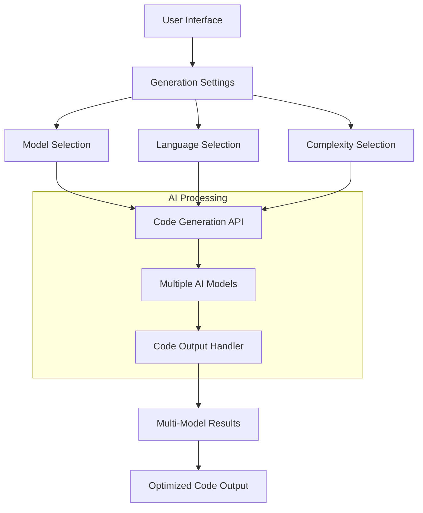
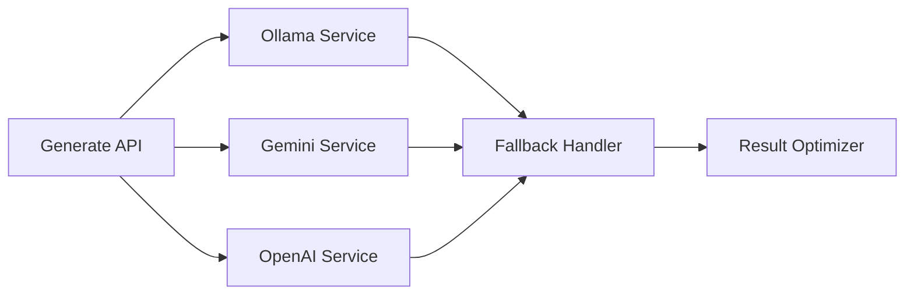
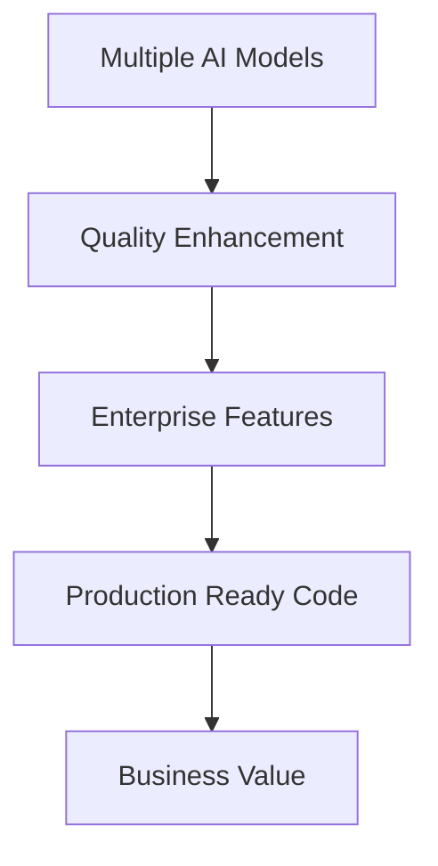
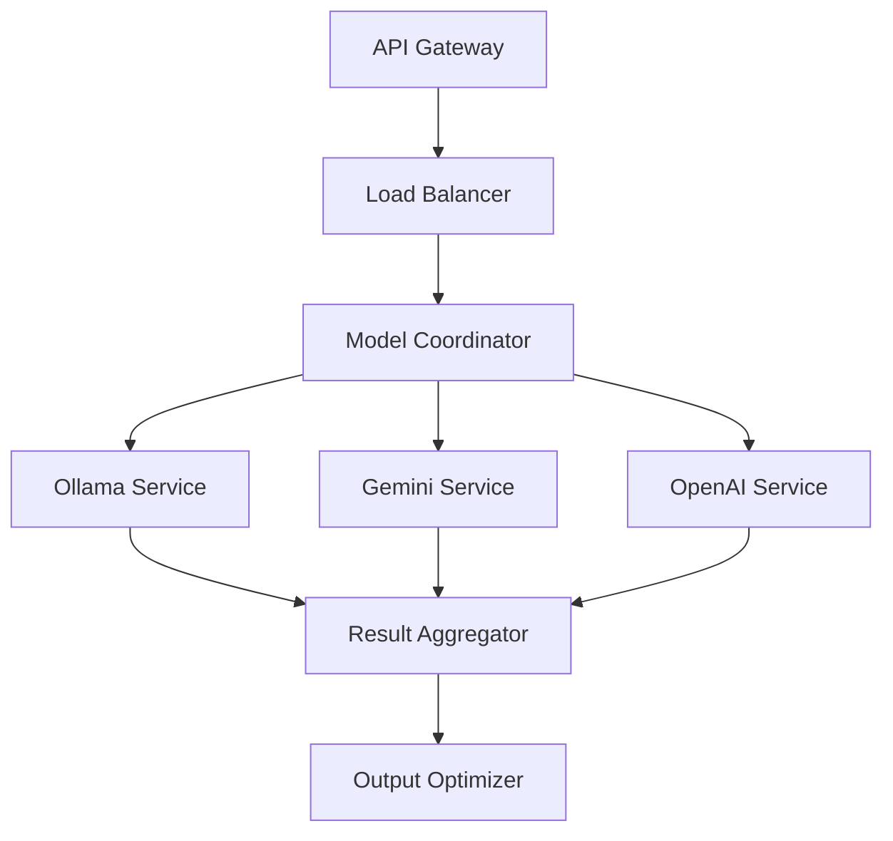
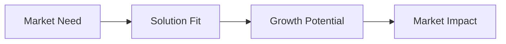
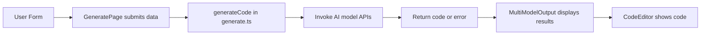

I'll analyze the AICodeCraft tool comprehensively. Let me break this down step by step.

### 1. Architecture & Flow Analysis

**Core Components Flow:**


### 2. Key Components Breakdown

1. **Frontend Components**
- 

GeneratePage

: Main interface
- 

ModelMultiSelect

: AI model selection
- 

LanguageSelector

: Programming language selection
- 

ComplexitySelector

: Code complexity level
- 

CodeOutput

: Generated code display
- 

MultiModelOutput

: Multiple model results display

2. **Core API Services**


### 3. Innovation Features

1. **Multi-Model Generation**
- Parallel code generation from multiple AI models
- Smart fallback mechanism
- Result optimization based on quality

2. **Advanced Prompt Engineering**
```typescript
const prompting = {
    basic: "Simple, functional implementation",
    intermediate: "Production-ready with best practices",
    advanced: "Enterprise-grade with optimizations"
}
```

3. **Language-Specific Optimization**
```typescript
const languageOptimization = {
    syntax: "Language-specific patterns",
    bestPractices: "Framework conventions",
    security: "Language-specific security patterns"
}
```

### 4. Problem Statement & Solution

**Problem:**
- Inconsistent code generation quality
- Limited language support
- Single model dependencies
- Lack of enterprise-grade features

**Solution:**


### 5. Unique Value Propositions

1. **Multi-Model Architecture**
- Parallel processing
- Quality comparison
- Automatic fallback

2. **Enterprise Focus**
```typescript
const enterpriseFeatures = {
    security: "Built-in security patterns",
    scalability: "Architecture best practices",
    maintenance: "Documentation & testing"
}
```

3. **Advanced Code Generation**
- Language-specific optimizations
- Framework awareness
- Best practices integration

### 6. API Architecture



### 7. Model Handling

```typescript
const modelHandling = {
    selection: "Smart model selection",
    fallback: "Automatic fallback system",
    optimization: "Result comparison & selection"
}
```

### 8. Hackathon Potential

**Strengths:**
1. Innovation in multi-model approach
2. Enterprise-grade features
3. Practical problem-solving
4. Scalable architecture

### 9. Innovation Factors

1. **Technical Innovation**
- Multi-model parallel processing
- Smart fallback system
- Language-specific optimization

2. **Business Innovation**
- Enterprise focus
- Quality assurance
- Cost optimization

### 10. Opportunity Assessment

**Market Opportunity:**


To continue with more technical details or specific aspects, let me know which area you'd like to explore further.

The tool shows significant potential for both technical innovation and business value, making it a strong candidate for hackathon presentation. Its unique multi-model approach and enterprise focus differentiate it from existing solutions.


Below is a brief conceptual overview:

1. Users choose models, language, complexity, and provide a prompt.  
2. The app sends a generation request (with API parameters like temperature, topP, topK, maxTokens) to each selected model.  
3. The backend (generate.ts) assembles prompts using complexity templates, calls AI APIs, and reports progress.  
4. Each model’s output is displayed in MultiModelOutput, providing copy/download features.  
5. If a model fails, the code handles it gracefully (fallback if available).  
6. The CodeEditor and other components render generated code with syntax highlighting.

Flow diagram (simplified Mermaid):



Prompt technique:  
• Templates differ by complexity (basic, intermediate, advanced).  
• The chosen model and prompt are combined into an instruction set for a specialized AI output.  

Model handling:  
• Each model is called in parallel and tracked in “modelOutputs.”  
• If a model fails, its status is marked “failed”; others keep going.  

Innovation and potential:  
• Automates multi-model code generation and comparisons.  
• Offers deeper customization (complexity, language, advanced prompt params).  
• Could be used at hackathons for rapid prototyping.  

Value and problem statement:  
• Simplifies exploring AI-generated code from multiple models.  
• Addresses the need to quickly compare results or code solutions in one place.  
• Adds clarity with previews, progress tracking, and error handling.


## **aicodecrat: Comprehensive Code Analysis**

### **Overview**
aicodecrat is a tool designed to generate and manage code using multiple AI models. It offers features such as syntax highlighting, model selection, complexity control, and progress tracking to facilitate efficient code generation.

### **Codebase Analysis**
- **Components:**
  - **CodeEditor.tsx:** Renders the code with syntax highlighting using `react-syntax-highlighter`.
  - **MultiModelOutput.tsx:** Displays outputs from multiple AI models with options to copy or download code.
  - **ModelMultiSelect.tsx:** Allows users to select multiple AI models.
  - **GenerationProgress.tsx:** Shows the progress of code generation.
  - **GenerationCodeEditor.tsx & CodeOutput.tsx:** Manage code editing and output display with error handling.
  - **ComplexitySelector.tsx:** Lets users choose the complexity level of the generated code.
  - **Generate.ts:** Handles API requests for code generation with different complexity prompts.
  - **GeneratePage.tsx:** Main page managing form inputs, submission, and displaying generated code.

### **Process Flow**
1. **User Interaction:**
   - Select programming language, AI models, complexity level, and other parameters on the Generate Page.
2. **Form Submission:**
   - 

onSubmit

 in 

GeneratePage.tsx

 validates inputs and initiates code generation.
3. **API Call:**
   - 

generateCode

 in 

generate.ts

 sends requests to selected AI models with appropriate prompts.
4. **Progress Tracking:**
   - 

GenerationProgress.tsx

 displays real-time progress updates.
5. **Output Display:**
   - 

MultiModelOutput.tsx

 shows the generated code from each model with options to copy or download.
6. **Error Handling:**
   - Components handle and display errors gracefully, ensuring a smooth user experience.

### **API Explanation**
- **Endpoint:** 

generateCode

 in 

generate.ts


- **Functionality:** Sends code generation requests to selected AI models based on user inputs.
- **Connection:** Utilizes asynchronous calls to handle multiple models concurrently, updating progress via callbacks.
- **Prompt Techniques:** Tailors prompts based on selected complexity (basic, intermediate, advanced) to guide AI in generating appropriate code.

### **Models Handling & Fallback Mechanism**
- **Selection:** Users can choose multiple AI models via 

ModelMultiSelect.tsx

.
- **Fallback:** If a model fails, the system marks it as failed and continues with others, ensuring continuity.
- **Error Handling:** Displays specific errors per model, allowing users to understand and rectify issues.

### **Innovative Solutions & Unique Features**
- **Multi-Model Support:** Generates code using multiple AI models simultaneously, providing diverse solutions.
- **Complexity Control:** Allows users to specify the complexity level, tailoring the generated code to their needs.
- **Real-Time Progress Tracking:** Offers transparency during code generation with live updates.
- **Integrated Code Editor:** Provides a seamless editing and viewing experience within the application.

### **Hackathon Potential**
aicodecrat showcases innovative use of multiple AI models for code generation, comprehensive user controls, and robust error handling, making it a strong contender for hackathons focused on AI, developer tools, or productivity enhancements.

### **Value Addition & Innovation Factor**
- **Efficiency:** Speeds up the coding process by leveraging AI to generate boilerplate or complex code snippets.
- **Customization:** Empowers users to tailor code generation based on language, complexity, and specific models.
- **Reliability:** Incorporates error handling and fallback mechanisms to ensure dependable performance.
- **User Experience:** Intuitive interface with real-time feedback and easy-to-use controls enhances developer productivity.

### **Problem Statement & Opportunity**
**Problem:** Developers often face time-consuming tasks in writing repetitive or complex code, leading to inefficiencies.
**Opportunity:** aicodecrat addresses this by automating code generation, allowing developers to focus on higher-level design and logic. It leverages multiple AI models to provide diverse and optimized code solutions, enhancing productivity and code quality.