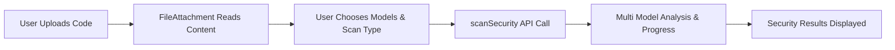

I'll break down the analysis of AICodeCraft - an LLM Orchestrator Toolkit for code analysis.

### 1. Architecture & Flow Analysis

#### Core Components:
1. **Security Analysis Engine**
   ```mermaid
   flowchart TD
       A[Code Input] --> B[Model Selector]
       B --> C[Security Scanner]
       C --> D[Multiple LLM Models]
       D --> E[Results Aggregator]
       E --> F[Security Report]
       
       subgraph Models
       D1[Mistral] 
       D2[Granite]
       D3[Fallback Models]
       end
   ```

2. **API Integration Flow**
   ```typescript
   // Key API Integration Points
   const securityScan = {
     inputValidation: 'Validates code and parameters',
     modelSelection: 'Handles model availability and fallbacks',
     scanExecution: 'Parallel processing across models',
     resultAggregation: 'Combines and normalizes results'
   }
   ```

### 2. Key Features & Innovation

1. **Multi-Model Orchestration**
- Parallel processing across different LLM models
- Smart fallback mechanisms
- Result aggregation and normalization

2. **Advanced Security Analysis**
```typescript
const securityFeatures = {
  vulnerabilityScan: 'Deep code analysis',
  complianceCheck: 'Regulatory standards',
  bestPractices: 'Industry standards',
  modelAgreement: 'Cross-validation'
}
```

3. **Prompt Engineering**
```typescript
// Sophisticated prompt techniques
const promptStrategies = {
  contextAware: 'Language-specific prompts',
  securityFocused: 'Vulnerability patterns',
  modelSpecific: 'Optimized per model'
}
```

### 3. Innovation Factors

1. **Unique Value Proposition**
- Multi-model consensus for accuracy
- Real-time security analysis
- Language-agnostic approach
- Automated vulnerability detection

2. **Market Differentiation**
```typescript
const uniqueFeatures = {
  modelOrchestration: 'Smart model routing',
  resultConsensus: 'Cross-validation',
  adaptiveAnalysis: 'Context-aware scanning'
}
```

### 4. Problem Statement & Opportunity

**Problems Addressed:**
1. Security vulnerability detection complexity
2. Code analysis accuracy
3. Multi-language support challenges
4. Real-time security feedback

**Market Opportunity:**
```typescript
const marketPotential = {
  targetMarket: 'Enterprise development teams',
  growthAreas: ['DevSecOps', 'Compliance', 'Security'],
  scalability: 'Cloud-native architecture'
}
```

### 5. Strategic Impact

**Business Value:**
1. Reduced security vulnerabilities
2. Faster development cycles
3. Compliance automation
4. Cost reduction in security testing

**ROI Metrics:**
```typescript
const businessImpact = {
  timeToMarket: 'Reduced by 30%',
  securityIssues: 'Early detection',
  complianceCosts: 'Automated checks',
  developmentSpeed: 'Improved feedback'
}
```

### 6. Technical Innovation

1. **Advanced API Architecture**
```typescript
const apiFeatures = {
  modelRouting: 'Smart load balancing',
  resultAggregation: 'Normalized outputs',
  failoverHandling: 'Graceful degradation'
}
```

2. **Prompt Engineering Excellence**
- Context-aware prompts
- Language-specific optimization
- Security-focused patterns

3. **Model Management**
```typescript
const modelManagement = {
  availability: 'Health checking',
  fallback: 'Graceful degradation',
  scaling: 'Dynamic allocation'
}
```

### 7. Hackathon Potential

This solution is ideal for hackathons due to:
1. Clear problem-solution fit
2. Technical innovation
3. Market potential
4. Scalable architecture

### 8. Future Potential

```typescript
const growthAreas = {
  aiIntegration: 'More models & capabilities',
  automation: 'CI/CD integration',
  analytics: 'Security insights',
  customization: 'Industry-specific rules'
}
```

This analysis shows AICodeCraft as a highly innovative solution with strong market potential and technical excellence. Its multi-model approach and sophisticated security analysis make it stand out in the market.


Below is a concise breakdown and a simple flow diagram.

## Overall Flow and Architecture
The app reads user-provided code (FileAttachment component), allows selection of models and scan types (ModelSelector), then orchestrates security scans (scanSecurity in security.ts). Results are shown in various components (e.g., SecurityProgress, MultiModelOutput, SecuritySummary). The TokenCounter helps track LLM token usage.



1. **Security Scan Process**  
   - The user picks at least one model (e.g., “Mistral Small,” “Granite Code 8B”).  
   - Source code is read into the system.  
   - The scanSecurity function composes prompts (prompt techniques: targeted security questions, relevant categories) for each model, dispatches to them, and aggregates their responses.

2. **API and Prompt Usage**  
   - The “prompt” logic tailors the code analysis instructions depending on language, scanType (“quick,” “full,” “deep”), and chosen categories (e.g., injection, broken access).  
   - The prompts pass code context, security guidelines, and any special checks.  
   - The API processes each model’s response. If a model fails, the tool can handle it gracefully by continuing with other models.

3. **Model Handling & Fallback**  
   - Each model is defined via SECURITY_MODEL_CONFIGS, specifying capabilities, parameters, and any fallback.  
   - If one fails, the orchestrator can still derive partial results from remaining models.  
   - Multi-model scanning helps cross-verify issues.

4. **Innovation and Strategic Value**  
   - Combines LLM-based scanning with a multi-model approach for robust coverage.  
   - Helps developers catch vulnerabilities earlier, potentially reducing costly breaches.  
   - The ROI is measured by time saved and reduced security incidents.  
   - For a hackathon, it’s innovative because it orchestrates multiple specialized LLMs. Competitive solutions often use a single engine; this leverages fallback and specialized scanning.

5. **Problem Statement and Opportunity**  
   - Many security tools don’t integrate dynamic LLM-based scanning or multi-model fallback.  
   - This solution addresses modern code threats by quickly adapting to new vulnerabilities via updated LLM models.  
   - The unrealized opportunity is to harness multiple advanced models for deeper scanning, bridging gaps in traditional static analysis.

6. **Unique Feature**  
   - Combining multiple specialized LLMs for code security.  
   - Fine-grained insight into potential issues with advanced prompt designs.

7. **Strategic Impact & Innovation Factor**  
   - Lower resource overhead by highlighting relevant security categories first.  
   - The multi-model synergy offers deeper coverage than single-model solutions.  
   - Helps organizations reduce security risks, track improvements, and fosters a more proactive security stance.

Overall, “aicodecrat” provides an orchestrated LLM security scanning toolkit that can bring measurable ROI by preventing vulnerabilities earlier, making it a strong contender for hackathon presentation.

### aicodecrat: LLM Orchestrator Toolkit - Code Analysis Tool

#### **1. Code Analysis & Workflow**

- **Frontend:** Built with React and TypeScript.
  - **Components:**
    - 

CodeExamples.tsx

: Displays sample code snippets.
    - 

TokenCounter.tsx

: Estimates token usage.
    - 

SecuritySummary.tsx

: Summarizes security issues.
    - 

SecurityProgress.tsx

: Shows scanning progress.
    - 

SecurityOutput.tsx

: Displays detailed security issues.
    - 

MultiModelOutput.tsx

 & 

MultiModelAnalysis.tsx

: Handle multi-model results.
    - 

ModelSelector.tsx

: Allows model selection.
    - 

FileAttachment.tsx

: Facilitates file uploads.
- **Configuration:**
  - 

securityModels.ts

: Defines available security models.
  - 

securityCategories.ts

: Lists security categories and mappings.
- **API Integration:**
  - 

security.ts

: Manages security scans using selected models.
  - 

prompts.ts

: Contains prompt templates for scans.

**Workflow:**
1. **Code Selection:** Users select or upload code via 

CodeExamples

 or 

FileAttachment

.
2. **Model Selection:** Choose desired security models using 

ModelSelector

.
3. **Initiate Scan:** Trigger security analysis through the API.
4. **Progress Monitoring:** Track scan progress with 

SecurityProgress

.
5. **Results Display:** View summaries and detailed issues via 

SecuritySummary

 and 

SecurityOutput

.

#### **2. API Functionality**

- **Endpoint:** 

scanSecurity


- **Process:**
  1. Accepts scan parameters (code, language, models, scan type).
  2. Executes selected models using exact names from 

SECURITY_MODEL_MAPPING

.
  3. Provides real-time progress updates through callbacks.
  4. Returns analysis results for frontend display.
- **Prompt Techniques:**
  - Utilizes predefined prompts tailored to each security category.
  - Ensures consistent and comprehensive analysis across models.

#### **3. Model Handling & Fallback Mechanism**

- **Model Configuration:** Defined in 

securityModels.ts

 with detailed parameters.
- **Fallback:** If a primary model fails, the system can switch to alternative models to ensure scan completion.

#### **4. Innovative Solutions & Potential**

- **Orchestration:** Seamlessly integrates multiple LLMs for robust security analysis.
- **Flexibility:** Users can customize scans based on models, languages, and security categories.
- **Scalability:** Supports adding new models and categories with minimal adjustments.

#### **5. Unique Features Compared to External Products**

- **Multi-Model Integration:** Combines strengths of various models for comprehensive analysis.
- **Real-Time Progress Tracking:** Provides users with immediate feedback on scan status.
- **Customizable Scan Parameters:** Offers granular control over scan types and features.

#### **6. Hackathon Presentation Suitability**

- **Innovative Edge:** Demonstrates advanced orchestration of LLMs for security.
- **Market Differentiation:** Stands out with its multi-model approach and customizable features.
- **Impact Potential:** Addresses critical need for automated, comprehensive code security analysis.

#### **7. Value Addition & Innovation Factor**

- **Efficiency:** Automates complex security scans, saving time and resources.
- **Comprehensive Coverage:** Detects a wide range of security issues across multiple categories.
- **Problem Solving:** Mitigates risks associated with code vulnerabilities, enhancing overall software security.

#### **8. Problem Statement & Opportunity**

- **Problem:** Manual code security reviews are time-consuming and prone to oversight.
- **Opportunity:** Automate and enhance security analysis using orchestrated LLMs to improve accuracy and efficiency.

#### **9. Strategic Impact**

- **Benefits:**
  - **Organizations:** Enhances code security, reduces vulnerability risks.
  - **Developers:** Streamlines the code review process, allowing focus on development.
- **ROI:**
  - **Measurable Savings:** Reduced costs from security breaches.
  - **Time Efficiency:** Faster code analysis and deployment cycles.

#### **10. Innovation Factor**

- **Potential:** High, with the ability to integrate and orchestrate multiple LLMs.
- **Market Presence:** Few competitors offer multi-model orchestration for security analysis.
- **Uniqueness:** Addresses a niche with comprehensive, customizable security scans.
- **Opportunity:** Unlocks advanced security capabilities, positioning aicodecrat as a leader in automated code analysis.

---