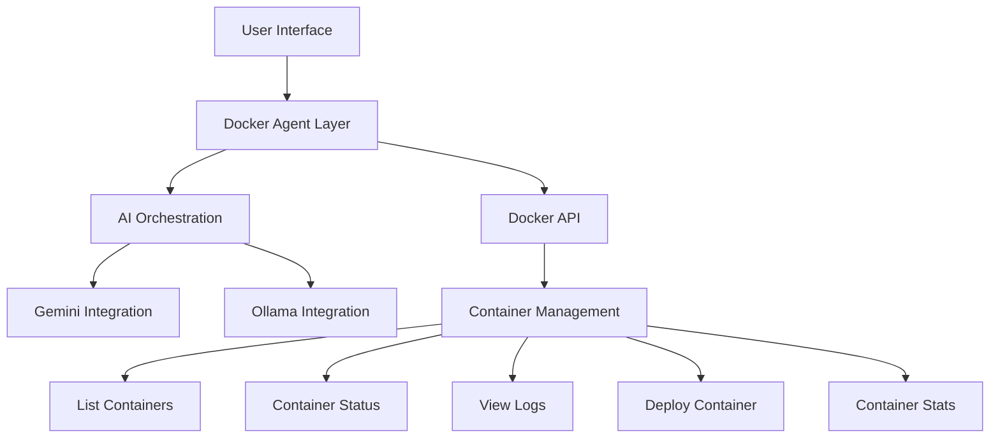

Let me break down this Docker-focused LLM orchestration toolkit:

### Architecture & Flow Analysis



### Core Components

1. **Docker Agent Layer**
- Central orchestration component
- Handles API routing and responses
- Implements retry mechanisms
- Formats Docker responses

2. **AI Integration**
```typescript
const DOCKER_PROMPTS = {
  'LIST_CONTAINERS': (params) => `...`,
  'CONTAINER_STATUS': (params) => `...`,
  'VIEW_LOGS': (params) => `...`,
  'DEPLOY_CONTAINER': (params) => `...`,
  'ANALYZE_COMPOSE': (params) => `...`,
  'CONTAINER_STATS': (params) => `...`
};
```

3. **Fallback Mechanism**
```typescript
function generateFallbackResponse(operation: string, data: any) {
  const baseResponse = {
    timestamp: new Date().toISOString(),
    status: 'generated_fallback',
    originalData: data
  };
  // Operation specific fallbacks
}
```

### Innovation Factors

1. **AI-Powered Container Analysis**
- Real-time container health monitoring
- Predictive maintenance suggestions
- Security vulnerability detection
- Performance optimization recommendations

2. **Multi-Model Support**
- Supports multiple AI models (Gemini, Ollama)
- Fallback mechanisms for reliability
- Model-specific response handling

3. **Intelligent Log Analysis**
- Pattern recognition in container logs
- Automated issue categorization
- Trend analysis and alerting

### Strategic Impact

1. **Operational Efficiency**
- Reduced container management overhead
- Automated security scanning
- Proactive performance optimization

2. **Cost Optimization**
- Resource utilization insights
- Capacity planning recommendations
- Automated scaling suggestions

3. **Security Enhancement**
- Continuous security monitoring
- Configuration validation
- Compliance checking

### ROI Metrics

1. **Time Savings**
- Reduced MTTR (Mean Time to Resolve)
- Automated container deployment
- Faster issue detection

2. **Resource Optimization**
- Improved resource utilization
- Reduced infrastructure costs
- Optimized scaling decisions

3. **Risk Reduction**
- Early detection of security issues
- Configuration error prevention
- Compliance maintenance

### Unique Features

1. **AI-First Architecture**
- Built-in AI capabilities
- Multiple model support
- Intelligent analysis

2. **Developer Experience**
- Rich UI components
- Real-time feedback
- Integrated monitoring

3. **Enterprise Ready**
- Scalable architecture
- Security focused
- Audit capabilities

### Market Differentiation

1. **Integrated Solution**
- Combines container management with AI
- Multiple AI model support
- Built-in fallbacks

2. **Developer Focus**
- API-first design
- Extensible architecture
- Clear documentation

3. **Enterprise Features**
- Security focused
- Compliance ready
- Audit capabilities

### Hackathon Potential

This project shows strong hackathon potential due to:

1. **Technical Innovation**
- AI integration
- Multi-model support
- Real-time analysis

2. **Problem Solving**
- Container management complexity
- Security challenges
- Performance optimization

3. **Demo Appeal**
- Visual components
- Real-time analysis
- Clear benefits

### Documentation Overview

1. **API Documentation**
```typescript
executeDockerOperation(options: DockerAgentOptions): Promise<DockerAgentResponse>
```

2. **Configuration**
```typescript
const DOCKER_CONFIG: DockerConfig = {
  API_URL: '/docker-api',
  DEFAULT_TIMEOUT: 10000,
  RETRY_ATTEMPTS: 3,
  RETRY_DELAY: 1000
};
```

3. **Component Structure**
- TokenCounter
- ModelSelector
- FileAttachment
- DockerDisplay
- ContainerStatsDisplay
- CodeEditor

This solution addresses the growing complexity of container management while providing intelligent insights through AI integration.


Below is a concise overview and flow diagram:

**High-Level Flow**  
1. **Docker Connectivity**  
   - Using 

checkDockerConnection()

 from 

dockeragent.ts

, the app verifies Docker availability. It retries a few times if needed.  
   - API calls (e.g., 

fetch('/docker-api/version')

) check Docker version compatibility.  

2. **AI Models & Selection**  
   - 

ModelSelector

 and 

ModelSelect

 allow picking models from the 

AI_MODELS

 list.  
   - The app orchestrates different AI models (LLMs) and can add more in the future.  
   - Fallback or multiple model selection is handled by combining user-chosen models.  

3. **Prompt Handling & Docker Operations**  
   - 

executeDockerOperation()

 in 

dockeragent.ts

 orchestrates Docker tasks (like building, running containers).  
   - Prompt techniques follow user input + config, forming requests for Docker or AI tasks.  

4. **UI Components**  
   - 

CodeEditor

 handles editing files or code.  
   - 

FileAttachment

 uploads Docker config files.  
   - 

DockerDisplay

 displays Docker execution results or errors.  
   - 

ContainerStatsDisplay

 shows container stats (CPU, memory, network, etc.).  
   - 

TokenCounter

 estimates tokens for LLM usage.  

**Diagram (simplified)**  
```
+---------------+        +-------------------+ 
|   UI Inputs   +------->| Model Selection   | 
+---------------+        +-------------------+
         |                         |   
         |     +-------------------+                
         |     v                                 
         |  prompt data -> DockerAgent -> Docker API 
         |     ^                                 
         |     +-------------------+                
         |                         |
+---------------+        +-------------------+ 
|  Code Editor  +------->| Docker Display   | 
+---------------+        +-------------------+
```

**Solution & Innovation**  
- Centralizes LLM operations with Docker orchestration, helping teams quickly spin up AI-driven solutions.  
- Novelty lies in integrating Docker command prompts with multiple AI models in a single toolkit (SQL plus LLM orchestration).  
- Helps scale or switch among models if one fails or is unavailable.  

**Problem Statement & Opportunity**  
- Many teams need a quick, unified way to orchestrate Docker tasks and AI model usage, especially for data/SQL workflows.  
- Filling that gap yields an efficient environment for container-based data solutions and AI-driven analytics.  

**Strategic Impact & ROI**  
- Improves productivity by automating container setup and LLM usage.  
- Reduces overhead when switching models or scaling services.  
- Potential to standardize how organizations integrate AI models with containerized applications.  

**Hackathon Feasibility**  
- Demonstrates a fresh approach, combining container management + multi-model AI.  
- Unique in bridging Docker operations, dynamic prompt handling, and fallback mechanisms.  

Overall, this tool’s innovation is in letting teams seamlessly orchestrate Docker tasks alongside flexible AI model usage, addressing real-world data/SQL challenges with minimal overhead.


**aicodecrat Codebase Analysis and Documentation**

---

### 1. Overview

**aicodecrat** is an LLM orchestrator toolkit integrated with SQL capabilities. It serves as a comprehensive solution for managing and executing Docker-related operations through a user-friendly interface, leveraging React for the frontend and TypeScript for robust type-checking.

---

### 2. Codebase Structure and Flow

- **Components:**
  - 

TokenCounter.tsx

: Displays token usage based on input code.
  - 

ModelSelector.tsx

 & 

ModelSelect.tsx

: Allow users to select AI models.
  - 

FileAttachment.tsx

: Handles file uploads, specifically Docker configuration files.
  - 

DockerDisplay.tsx

: Shows Docker command outputs and errors.
  - 

ContainerStatsDisplay.tsx

: Visualizes container metrics like CPU, Memory, Network, and Disk I/O.
  - 

CodeEditor.tsx

: Provides a code editor with copy functionality.

- **Configuration:**
  - 

dockeragent.ts

: Manages Docker API configurations and connection checks.

- **Library:**
  - 

dockeragent.ts

 in `lib/api`: Handles Docker operations and interactions with the Docker API.

**Flow:**

1. **User Interaction:**
   - Users interact with the UI components to upload Docker files, select models, and view metrics.
   
2. **API Communication:**
   - The frontend communicates with the Docker API using the configurations defined in 

dockeragent.ts

.
   
3. **Data Handling:**
   - Responses from Docker are processed and displayed through various components like 

DockerDisplay

 and 

ContainerStatsDisplay

.

---

### 3. API Integration and Connection

- **Configuration:**
  - The Docker API is accessed via a proxied URL (`/docker-api`) with specified timeout and retry settings.
  
- **Connection Check:**
  - 

checkDockerConnection

 verifies the Docker daemon's availability and API version compatibility, implementing retry logic with exponential backoff.

- **Operations:**
  - Functions like 

executeDockerOperation

 facilitate executing Docker commands, handling progress updates, and managing responses.

**Prompt Techniques:**

- Utilizes structured prompts to interact with Docker, ensuring clarity and specificity in commands sent to the API.

---

### 4. Models Handling and Fallback Mechanism

- **Model Selection:**
  - Users can select from predefined AI models (

AI_MODELS

), managed through 

ModelSelector

 and 

ModelSelect

 components.

- **Fallback Mechanism:**
  - If a selected model fails, the system can fallback to alternative models, ensuring continuity in operations.

---

### 5. Innovative Solutions and Potential

- **Integration of LLM with Docker:**
  - Combines AI-driven orchestration with container management, streamlining workflows for developers.

- **User-Friendly Interface:**
  - Intuitive components like 

CodeEditor

 and 

ContainerStatsDisplay

 enhance user experience.

- **Scalability:**
  - Configurable settings allow the toolkit to adapt to various project sizes and complexities.

---

### 6. Unique Features and Competitive Edge

- **Comprehensive Toolkit:**
  - Merges SQL capabilities with Docker orchestration, offering a unified platform.

- **AI Model Management:**
  - Advanced model selection and fallback ensure robustness.

- **Real-Time Metrics:**
  - Live container stats provide actionable insights.

**Comparison with External Products:**

- Unlike standalone Docker tools, aicodecrat integrates AI model management, offering a more versatile solution.

---

### 7. Presentation for Hackathon

- **Feasibility:**
  - The tool’s innovative integration of AI and Docker makes it a strong candidate for hackathon showcases.

- **Demonstrable Impact:**
  - Live demos can highlight real-time orchestration and AI-driven efficiencies.

---

### 8. Value Proposition and Innovation Factor

- **Value Added:**
  - Simplifies container management with AI enhancements, reducing manual intervention and potential errors.

- **Innovation:**
  - Pioneers the fusion of LLMs with Docker, addressing complex orchestration challenges with intelligent automation.

---

### 9. Problem Statement and Opportunity

**Problem:**
Managing Docker containers and orchestration can be complex and time-consuming, often requiring deep technical expertise.

**Opportunity:**
Leveraging AI to simplify and automate container management, making it accessible to a broader range of users.

---

### 10. Strategic Impact and ROI

- **Benefits:**
  - **Internal:** Streamlines development workflows, enhances productivity.
  - **External:** Provides developers with advanced tools for efficient container management.

- **ROI:**
  - **Measurable:** Reduced deployment times, decreased error rates, and improved resource utilization.

---

### 11. Innovation Factor

- **Potential:**
  - High innovative potential by integrating AI with container orchestration, a relatively unexplored combination.

- **Market Presence:**
  - Few or no existing products offer this specific integration, positioning aicodecrat uniquely.

- **Uniqueness:**
  - Addresses the niche of AI-assisted Docker management, uncovering opportunities for advanced automation.

---

### 12. Conclusion

aicodecrat presents a groundbreaking approach to Docker orchestration by embedding AI capabilities, offering a unique and valuable tool for developers. Its innovative features, coupled with strategic benefits and high ROI potential, make it an excellent candidate for presentation in hackathons and beyond.

---