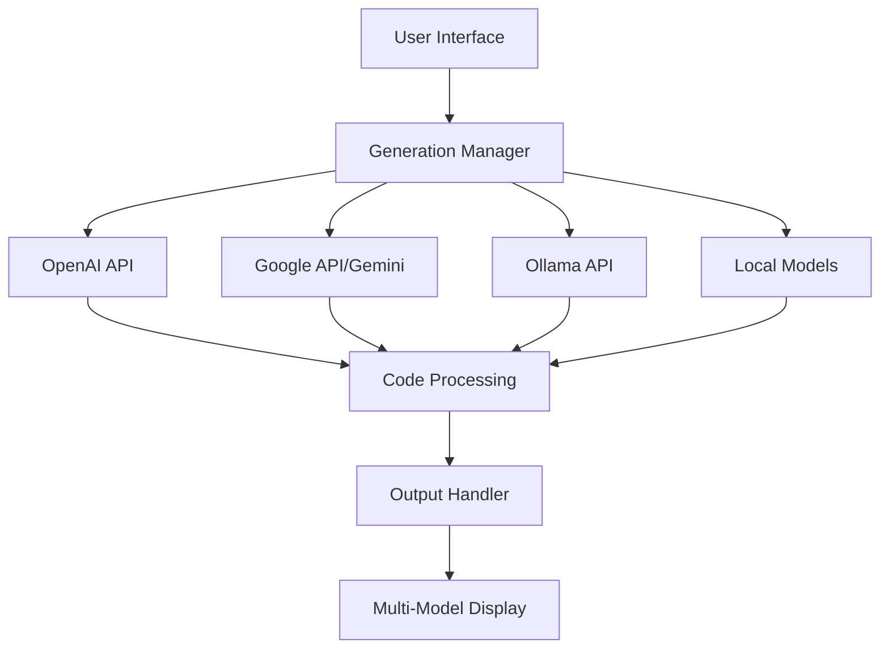
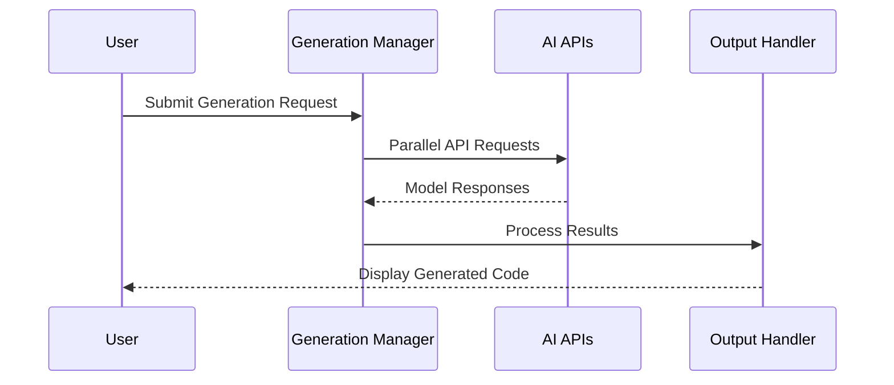
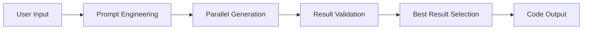

Let me break down the documentation for this CodeCraft application step by step.

# CodeCraft: Multi-Model Code Generation Platform

## 1. Overview

### System Architecture


### Key Features
1. Multi-Model Generation
2. Language-Specific Optimizations
3. Complexity Levels
4. Real-time Progress Tracking
5. Code Quality Controls
6. Advanced Parameters

## 2. API Integration

### 2.1 Supported Model Providers

```typescript
// Model Provider Configuration
const PROVIDERS = {
  GOOGLE: {
    models: ['gemini-pro-code', 'gemini-pro', 'gemini-1.5-pro-001'],
    api: 'GoogleGenerativeAI'
  },
  OLLAMA: {
    models: ['codellama', 'llama3.3', 'granite-code', 'deepseek-coder'],
    api: 'Local Ollama API'
  }
}
```

### 2.2 API Flow


## 3. Multi-Model Features

### 3.1 Model Capabilities

| Model | Strengths | Use Cases |
|-------|-----------|-----------|
| Gemini Pro Code | - High accuracy<br>- Modern frameworks | Web Development |
| CodeLlama | - System programming<br>- Algorithms | Backend/Systems |
| DeepSeek | - Enterprise code<br>- Architecture | Large Projects |

### 3.2 Benefits of Multi-Model Approach

1. **Redundancy & Reliability**
```typescript
// Example of fallback mechanism
const MODEL_CONFIGS = {
  "codellama": {
    fallbacks: ["codellama:13b", "codegemma"],
    timeout: 30,
    temperature: 0.7
  }
}
```

2. **Quality Comparison**
- Multiple implementations for best results
- Cross-validation of generated code
- Different perspectives on solutions

3. **Specialized Expertise**
- Each model has unique strengths
- Language-specific optimizations
- Different complexity levels

## 4. Code Generation Process

### 4.1 Generation Flow


### 4.2 Key Components

1. **ModelMultiSelect**
```typescript
interface ModelMultiSelectProps {
  selectedModels: string[];
  onChange: (models: string[]) => void;
}
```

2. **ComplexitySelector**
```typescript
type ComplexityLevel = 'basic' | 'intermediate' | 'advanced';
```

3. **CodeOutput**
```typescript
interface CodeOutputProps {
  code: string;
  language: string;
  isGenerating: boolean;
  progress: number;
}
```

## 5. Features & Benefits

### 5.1 Advanced Configuration
1. Temperature Control
2. Top-P Sampling
3. Token Limits
4. Language Optimization

### 5.2 Code Quality
- Error Handling
- Best Practices
- Documentation
- Performance Optimization

### 5.3 Development Benefits
1. Faster Development
2. Higher Quality Code
3. Multiple Perspectives
4. Learning Opportunities

## 6. Implementation Example

```typescript
// Example usage of the generation API
const generateCode = async (request: GenerationRequest) => {
  const { modelIds, prompt, language, complexity } = request;
  
  // Parallel generation using multiple models
  const results = await Promise.allSettled(
    modelIds.map(modelId => 
      generateWithModel(prompt, modelId, language, complexity)
    )
  );
  
  // Select best result
  return selectBestResult(results);
};
```

## 7. Security & Best Practices

### 7.1 Security Measures
1. Input Validation
2. Code Sanitization
3. Rate Limiting
4. Error Handling

### 7.2 Performance Optimization
```typescript
// Example of caching implementation
const MODEL_CACHE = new Map<string, {
  result: string;
  timestamp: number;
}>();
```

## 8. Future Enhancements

1. Additional Model Support
2. Advanced Caching
3. Custom Model Training
4. Enhanced Code Analysis
5. Integration with Development Tools

This documentation provides a comprehensive overview of the CodeCraft platform's architecture, features, and benefits. The multi-model approach offers unique advantages in code generation quality and reliability.

Would you like me to expand on any particular aspect of the documentation?


Sure, here's a comprehensive documentation for the code provided:

---

# CodeCraft: Multi-Model Code Generation Platform

## Overview

CodeCraft is an advanced code generation platform that leverages multiple AI models to generate high-quality, production-ready code. This platform integrates various AI models to provide optimal results based on user requirements, such as language, complexity, and specific prompts.

## Features

1. **Multi-Model Support**: Utilizes multiple AI models to generate code, ensuring the best possible output.
2. **Complexity Levels**: Supports different complexity levels (basic, intermediate, advanced) to cater to various coding needs.
3. **Language Support**: Can generate code in multiple programming languages.
4. **Real-Time Progress Tracking**: Displays the progress of code generation in real-time.
5. **Error Handling**: Provides detailed error messages if code generation fails.
6. **Code Output Management**: Allows users to copy or download the generated code.

## How It Works

### User Interface

The user interacts with the platform through a web interface, where they can configure their code generation settings, provide prompts, and select the desired AI models.

### Configuration

1. **Model Selection**: Users can select one or more AI models from a list of available models.
2. **Language Selection**: Users can choose the programming language for the generated code.
3. **Complexity Selection**: Users can select the complexity level for the generated code.
4. **Prompt Input**: Users provide a detailed prompt describing the code they want to generate.

### Code Generation Process

1. **Form Submission**: When the user submits the form, the platform validates the input and starts the code generation process.
2. **API Requests**: The platform sends requests to the selected AI models' APIs with the provided prompt and configuration.
3. **Progress Tracking**: The platform tracks the progress of each model and updates the user interface in real-time.
4. **Result Aggregation**: Once the code generation is complete, the platform aggregates the results from all models and displays them to the user.

### API Integration

The platform integrates with various AI model providers through their APIs. Each model has specific configurations, such as timeout, temperature, and fallback models.

### Code Output

The generated code is displayed in a code editor with syntax highlighting. Users can copy the code to the clipboard or download it as a file.

## Benefits of Multi-Model Features

1. **Diverse Expertise**: Different models have different strengths, ensuring a more comprehensive and accurate code generation.
2. **Fallback Mechanism**: If one model fails, others can still provide results, increasing the reliability of the platform.
3. **Optimal Results**: By combining outputs from multiple models, the platform can provide the best possible code generation results.

## Detailed Code Flow

### 

GeneratePage.tsx


- **Form Handling**: Uses `react-hook-form` and `zod` for form validation and handling.
- **Model Selection**: Users can select multiple models using the 

ModelMultiSelect

 component.
- **Language and Complexity Selection**: Users can select the language and complexity level using 

LanguageSelector

 and 

ComplexitySelector

 components.
- **Prompt Input**: Users provide a detailed prompt in a textarea.
- **Submit Handler**: On form submission, the 

onSubmit

 function is called, which initiates the code generation process.

### 

MultiModelOutput.tsx


- **Progress Tracking**: Displays the progress of each model's code generation.
- **Code Display**: Shows the generated code for each model in a collapsible section.
- **Copy and Download**: Provides buttons to copy the code to the clipboard or download it as a file.

### 

CodeOutput.tsx


- **Code Editor**: Uses 

CodeMirror

 for displaying the generated code with syntax highlighting.
- **Copy and Download**: Provides buttons to copy the code to the clipboard or download it as a file.
- **Error Handling**: Displays error messages if code generation fails.

### API Integration

- **generate.ts**: Contains functions for building prompts, sending requests to AI model APIs, and handling responses.
- **models.ts**: Defines the configuration for each AI model, including fallbacks, timeouts, and other parameters.

## Conclusion

CodeCraft is a powerful platform for generating high-quality code using multiple AI models. Its multi-model approach ensures optimal results, making it a valuable tool for developers looking to automate code generation tasks.

---

This documentation provides an overview of the platform, its features, how it works, and the benefits of using multi-model features. It also includes a detailed explanation of the code flow and API integration.


The code generation API works by integrating multiple AI models to generate code based on user inputs. Here is a detailed explanation of how the API works:

## API Workflow

1. **User Input**: The user provides input through a form, specifying the programming language, complexity level, prompt, and selected AI models.

2. **Form Validation**: The input is validated using `zod` to ensure all required fields are correctly filled.

3. **Prompt Building**: Based on the user input, a prompt is constructed to guide the AI models in generating the desired code. The prompt includes specific instructions tailored to the selected language and complexity level.

4. **Model Selection**: The selected AI models are prepared for code generation. Each model has specific configurations, such as timeout, temperature, and fallback models.

5. **API Requests**: The platform sends requests to the selected AI models' APIs with the constructed prompt and configuration.

6. **Progress Tracking**: The progress of each model's code generation is tracked and updated in real-time. This is done using a progress callback function.

7. **Result Aggregation**: Once the code generation is complete, the results from all models are aggregated. The platform selects the most comprehensive result as the main output.

8. **Error Handling**: If code generation fails for any model, detailed error messages are provided. The platform also attempts to use fallback models if the primary model fails.

9. **Code Output**: The generated code is displayed in a code editor with syntax highlighting. Users can copy the code to the clipboard or download it as a file.

## Detailed Code Flow

### 1. User Input and Form Validation

The user provides input through a form, specifying the programming language, complexity level, prompt, and selected AI models. The input is validated using `zod` to ensure all required fields are correctly filled.

### 2. Prompt Building

The 

buildPrompt

 function constructs a prompt based on the user input. The prompt includes specific instructions tailored to the selected language and complexity level.

```typescript
function buildPrompt(language: string, complexity: ComplexityLevel, prompt: string): string {
  // Construct prompt based on language and complexity
  return `You are an expert ${language} developer. Generate production-ready code that solves the following problem.

TASK:
${prompt}

REQUIREMENTS:
1. Use ${language} best practices and conventions
2. Include proper error handling
3. Add clear comments explaining the logic
4. Follow standard coding patterns
5. Use clear variable/function naming
6. Make code modular and maintainable
7. Complexity level: ${complexity}

FORMAT:
\`\`\`${language}
[Your code here]
\`\`\`

Ensure the code:
- Is complete and runnable
- Has proper indentation
- Includes necessary imports/dependencies
- Follows ${language} style guidelines`;
}
```

### 3. Model Selection

The selected AI models are prepared for code generation. Each model has specific configurations, such as timeout, temperature, and fallback models.

### 4. API Requests

The platform sends requests to the selected AI models' APIs with the constructed prompt and configuration. The 

generateCode

 function handles this process.

```typescript
export async function generateCode(
  request: GenerationRequest,
  onProgress?: ProgressCallback
): Promise<string> {
  const { modelIds, prompt, language, complexity } = request;
  
  const availableModels = modelIds;

  onProgress?.(
    availableModels.reduce((acc, modelId) => ({
      ...acc,
      [modelId]: { modelId, status: 'pending' }
    }), {})
  );

  const results = await Promise.allSettled(
    availableModels.map(async (modelId) => {
      try {
        onProgress?.({
          [modelId]: { modelId, status: 'generating' }
        });

        const modelPrompt = buildPrompt(language, complexity, prompt);
        
        let result: string;
        if (modelId.startsWith('gemini-')) {
          result = await generateWithGemini(modelPrompt, modelId);
        } else {
          result = await generateWithOllama(modelPrompt, modelId);
        }

        const code = extractCodeFromResponse(result, language);
        
        onProgress?.({
          [modelId]: { 
            modelId, 
            status: 'completed', 
            result: code 
          }
        });

        return { modelId, result: code };
      } catch (error) {
        onProgress?.({
          [modelId]: { 
            modelId, 
            status: 'failed',
            error: error instanceof Error ? error.message : 'Unknown error'
          }
        });
        
        throw error;
      }
    })
  );

  const successfulResults = results
    .filter((r): r is PromiseFulfilledResult<{modelId: string; result: string}> => 
      r.status === 'fulfilled' && Boolean(r.value?.result)
    )
    .map(r => r.value);

  if (successfulResults.length === 0) {
    const errors = results
      .filter((r): r is PromiseRejectedResult => r.status === 'rejected')
      .map(r => r.reason.message || 'Unknown error')
      .join('; ');
    throw new Error(`Generation failed: ${errors}`);
  }

  return successfulResults.reduce((best, current) => 
    (current.result.length > best.result.length) ? current : best
  ).result;
}
```

### 5. Progress Tracking

The progress of each model's code generation is tracked and updated in real-time using a progress callback function.

### 6. Result Aggregation

Once the code generation is complete, the results from all models are aggregated. The platform selects the most comprehensive result as the main output.

### 7. Error Handling

If code generation fails for any model, detailed error messages are provided. The platform also attempts to use fallback models if the primary model fails.

### 8. Code Output

The generated code is displayed in a code editor with syntax highlighting. Users can copy the code to the clipboard or download it as a file.

## Benefits of Multi-Model Features

1. **Diverse Expertise**: Different models have different strengths, ensuring a more comprehensive and accurate code generation.
2. **Fallback Mechanism**: If one model fails, others can still provide results, increasing the reliability of the platform.
3. **Optimal Results**: By combining outputs from multiple models, the platform can provide the best possible code generation results.

---

This documentation provides a detailed explanation of how the code generation API works, including the workflow, code flow, and benefits of using multi-model features.


# Code Generation API Documentation

## 1. Core Components

### Request Interface
```typescript
interface GenerationRequest {
  modelIds: string[];       // AI models to use
  prompt: string;          // User's code generation prompt
  language: string;        // Target programming language
  complexity: ComplexityLevel; // 'basic' | 'intermediate' | 'advanced'
}
```

### Models & Providers
```typescript
const MODEL_CONFIGS = {
  "gemini-pro-code": {     // Google's Gemini API
    provider: 'google',
    maxTokens: 8192
  },
  "codellama": {           // Ollama Local Models
    provider: 'ollama',
    maxTokens: 4096
  },
  "deepseek-coder": {      // Ollama Local Models
    provider: 'ollama',
    maxTokens: 4096
  }
}
```

## 2. Generation Flow

1. **Request Processing**
```typescript
export async function generateCode(request: GenerationRequest): Promise<string> {
  const { modelIds, prompt, language, complexity } = request;
  
  // Generate with multiple models in parallel
  const results = await Promise.allSettled(
    modelIds.map(modelId => generateWithModel(modelId, prompt))
  );
}
```

2. **Model-Specific Generation**
```typescript
// For Gemini
async function generateWithGemini(prompt: string, modelId: string) {
  const genAI = new GoogleGenerativeAI(API_KEY);
  const model = genAI.getGenerativeModel({ model: modelId });
  const result = await model.generateContent(prompt);
  return result.response.text();
}

// For Ollama
async function generateWithOllama(prompt: string, modelId: string) {
  const response = await fetch(`${OLLAMA_URL}/api/generate`, {
    method: 'POST',
    body: JSON.stringify({
      model: modelId,
      prompt: prompt
    })
  });
  return response.json();
}
```

3. **Fallback Mechanism**
```typescript
if (MODEL_CONFIGS[modelId]?.fallbacks?.length) {
  const fallbackId = MODEL_CONFIGS[modelId].fallbacks[0];
  return generateWithModel(fallbackId, prompt);
}
```

## 3. Progress Tracking

```typescript
type GenerationProgress = {
  modelId: string;
  status: 'pending' | 'generating' | 'completed' | 'failed';
  result?: string;
  error?: string;
};

// Usage
onProgress?.({
  [modelId]: { 
    modelId, 
    status: 'generating' 
  }
});
```

## 4. Example Usage

```typescript
// Generate code with multiple models
const result = await generateCode({
  modelIds: ['gemini-pro-code', 'codellama'],
  prompt: 'Create a REST API endpoint in Express',
  language: 'javascript',
  complexity: 'intermediate'
}, (progress) => {
  console.log('Generation progress:', progress);
});
```

## 5. Error Handling

```typescript
try {
  const result = await generateCode(request);
} catch (error) {
  // Handle specific error types
  if (error instanceof ApiKeyError) {
    // Handle API key issues
  } else if (error instanceof ModelNotFoundError) {
    // Handle missing model
  } else {
    // Generic error handling
  }
}
```

## 6. Configuration

```typescript
const ENV_CONFIG = {
  GOOGLE_API_KEY: process.env.GOOGLE_API_KEY,
  OLLAMA_API_URL: process.env.OLLAMA_API_URL || 'http://localhost:11434'
}
```

## 7. Benefits

- **Multi-Model Generation**: Parallel code generation from multiple AI models
- **Fallback Support**: Automatic fallback to alternative models
- **Progress Tracking**: Real-time generation progress updates
- **Language Optimization**: Language-specific prompt optimization
- **Error Recovery**: Robust error handling and recovery mechanisms
- **Complexity Levels**: Support for different code complexity requirements