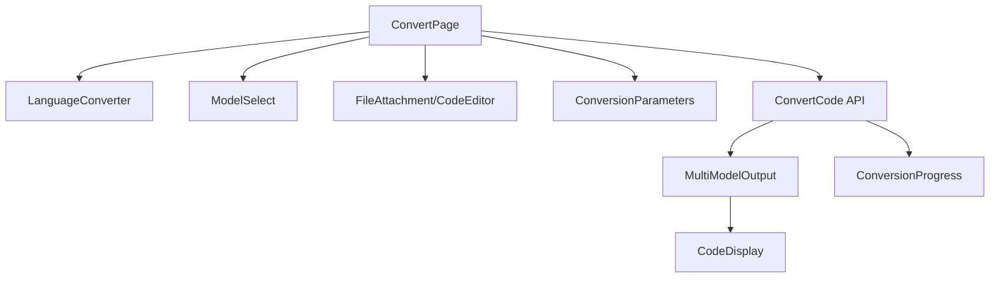
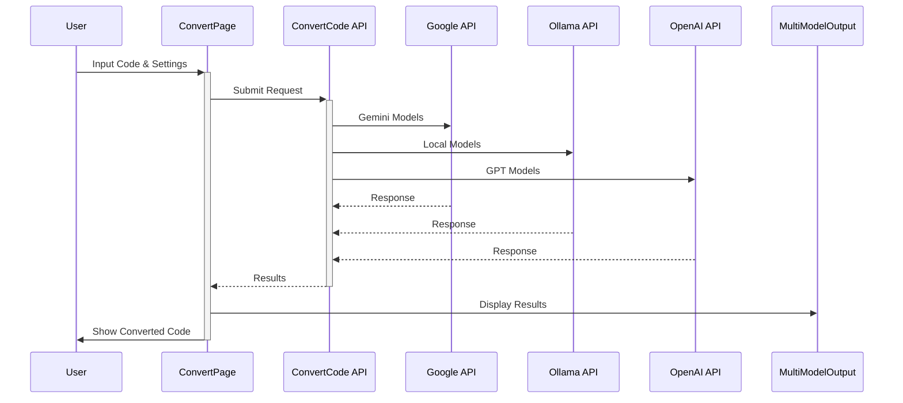
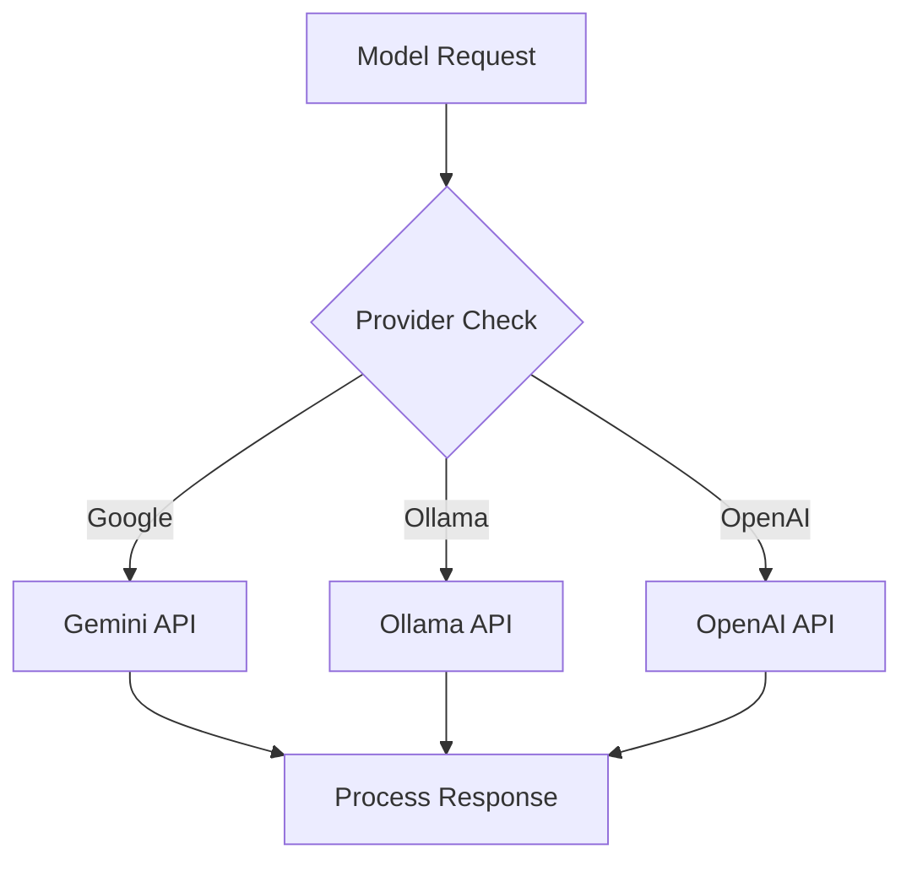

I'll break down the code flow and API interaction step by step.

### High-Level Overview

1. The application is a code conversion tool that supports multiple programming languages and AI models
2. Users can input code via editor or file upload
3. Multiple AI models can process the code simultaneously
4. Progress tracking and real-time updates are provided
5. The converted code is displayed with syntax highlighting

### Key Components Flow



### Detailed Process Flow



### API Integration Flow

1. **Request Initialization**
```typescript
// in convert.ts
export async function convertCode(request: GenerationRequest, onProgress?: ProgressCallback) {
  const { modelIds, sourceLanguage, targetLanguage } = request;
```

2. **Model Processing**
```typescript
const results = await Promise.allSettled(
  modelIds.map(async (modelId) => {
    // Process each model in parallel
  })
);
```

3. **Provider Selection**


4. **Progress Tracking**
```typescript
// Progress callback structure
type ConversionProgress = {
  modelId: string;
  status: 'pending' | 'converting' | 'completed' | 'failed';
  progress: number;
  result?: string;
  error?: string;
}
```

### Key Files and Their Roles

1. **ConvertPage.tsx**
- Main container component
- Manages form state and submission
- Coordinates all sub-components

2. **convert.ts**
- Core API integration
- Handles model selection and requests
- Manages progress tracking

3. **MultiModelOutput.tsx**
- Displays results from multiple models
- Handles downloading converted code
- Shows progress indicators

4. **models.ts**
- Defines available AI models
- Configures model settings
- Sets fallback options

5. **languages.ts**
- Defines supported languages
- Maps file extensions
- Sets language features

Would you like me to expand on any particular aspect or generate more detailed diagrams for specific components?


Sure, let's break down the process and explain how the code works, including the API flow.

### Overview

The project is a code conversion tool that allows users to convert code from one programming language to another using various AI models. The main components of the project include:

1. **UI Components**: These are React components that provide the user interface for selecting models, uploading files, setting conversion parameters, and displaying conversion progress and results.
2. **API Integration**: The backend API handles the actual code conversion using different AI models.

### Key Components

1. **ConvertPage.tsx**: This is the main page where users interact with the conversion tool. It includes form handling, file upload, and conversion initiation.
2. **CodeDisplay.tsx**: Displays the converted code or any errors that occur during the conversion process.
3. **TokenCounter.tsx**: Displays the token count of the converted code.
4. **MultiModelOutput.tsx**: Shows the output from multiple AI models.
5. **ModelSelect.tsx**: Allows users to select which AI models to use for conversion.
6. **LanguageConverter.tsx**: Allows users to select source and target languages for conversion.
7. **FileAttachment.tsx**: Handles file uploads for source code.
8. **ConversionProgress.tsx**: Displays the progress of the conversion process.
9. **ConversionParameters.tsx**: Allows users to set parameters like temperature, topP, and topK for the conversion.
10. **ComplexitySelector.tsx**: Allows users to select the complexity level of the conversion.
11. **CodeEditor.tsx**: Provides a code editor for users to input or edit source code.

### API Flow

1. **User Input**: The user selects the source and target languages, uploads a source code file, selects AI models, and sets conversion parameters.
2. **Form Submission**: When the user submits the form, the 

onSubmit

 function in 

ConvertPage.tsx

 is called.
3. **API Request**: The 

convertCode

 function in 

convert.ts

 is called with the user's input data. This function handles the API request to the AI models.
4. **Progress Updates**: The 

convertCode

 function uses a 

ProgressCallback

 to update the conversion progress. This is reflected in the 

ConversionProgress

 component.
5. **Conversion Result**: Once the conversion is complete, the result is displayed in the 

CodeDisplay

 component. If there are multiple models, their outputs are shown in the 

MultiModelOutput

 component.

### Detailed Flow

1. **ConvertPage.tsx**:
   - Handles form submission and validation.
   - Manages state for source code, converted code, conversion progress, and model outputs.
   - Calls 

convertCode

 to initiate the conversion process.

2. **convert.ts**:
   - Defines the 

convertCode

 function, which handles the API request to the AI models.
   - Uses 

createConversionPrompt

 to generate the prompt for the AI models based on the user's input.
   - Handles progress updates and error handling.

3. **CodeDisplay.tsx**:
   - Displays the converted code or any errors that occur during the conversion process.
   - Uses 

TokenCounter

 to display the token count of the converted code.

4. **TokenCounter.tsx**:
   - Calculates and displays the token count of the converted code.

5. **MultiModelOutput.tsx**:
   - Displays the output from multiple AI models.
   - Allows users to download the converted code.

6. **ModelSelect.tsx**:
   - Allows users to select which AI models to use for conversion.

7. **LanguageConverter.tsx**:
   - Allows users to select source and target languages for conversion.

8. **FileAttachment.tsx**:
   - Handles file uploads for source code.

9. **ConversionProgress.tsx**:
   - Displays the progress of the conversion process.

10. **ConversionParameters.tsx**:
    - Allows users to set parameters like temperature, topP, and topK for the conversion.

11. **ComplexitySelector.tsx**:
    - Allows users to select the complexity level of the conversion.

12. **CodeEditor.tsx**:
    - Provides a code editor for users to input or edit source code.

### Flow Diagram

Below is a simplified flow diagram of the process:

```plaintext
+-------------------+       +-------------------+       +-------------------+
|                   |       |                   |       |                   |
|  User Input       |       |  Form Submission  |       |  API Request      |
|                   |       |                   |       |                   |
+-------------------+       +-------------------+       +-------------------+
         |                           |                           |
         v                           v                           v
+-------------------+       +-------------------+       +-------------------+
|                   |       |                   |       |                   |
|  ConvertPage.tsx  |       |  onSubmit         |       |  convertCode      |
|                   |       |                   |       |                   |
+-------------------+       +-------------------+       +-------------------+
         |                           |                           |
         v                           v                           v
+-------------------+       +-------------------+       +-------------------+
|                   |       |                   |       |                   |
|  FileAttachment   |       |  Validation       |       |  API Call         |
|                   |       |                   |       |                   |
+-------------------+       +-------------------+       +-------------------+
         |                           |                           |
         v                           v                           v
+-------------------+       +-------------------+       +-------------------+
|                   |       |                   |       |                   |
|  LanguageConverter|       |  Progress Updates |       |  ProgressCallback |
|                   |       |                   |       |                   |
+-------------------+       +-------------------+       +-------------------+
         |                           |                           |
         v                           v                           v
+-------------------+       +-------------------+       +-------------------+
|                   |       |                   |       |                   |
|  ModelSelect      |       |  Conversion       |       |  Conversion Result|
|                   |       |                   |       |                   |
+-------------------+       +-------------------+       +-------------------+
         |                           |                           |
         v                           v                           v
+-------------------+       +-------------------+       +-------------------+
|                   |       |                   |       |                   |
|  ConversionParams |       |  Error Handling   |       |  CodeDisplay      |
|                   |       |                   |       |                   |
+-------------------+       +-------------------+       +-------------------+
         |                           |                           |
         v                           v                           v
+-------------------+       +-------------------+       +-------------------+
|                   |       |                   |       |                   |
|  ComplexitySelect |       |  MultiModelOutput |       |  TokenCounter     |
|                   |       |                   |       |                   |
+-------------------+       +-------------------+       +-------------------+
         |                           |                           |
         v                           v                           v
+-------------------+       +-------------------+       +-------------------+
|                   |       |                   |       |                   |
|  CodeEditor       |       |  ConversionProgress|      |  Download Code    |
|                   |       |                   |       |                   |
+-------------------+       +-------------------+       +-------------------+
```

This flow diagram represents the high-level process of how the code conversion tool works, from user input to displaying the conversion result.


Sure, let's break down the 

convert.ts

 file and explain how the API works.

### Overview

The 

convert.ts

 file contains the logic for converting source code from one programming language to another using various AI models. It includes functions to create conversion prompts, handle API requests to different AI providers, and manage the conversion progress.

### Key Functions

1. **createConversionPrompt**: Generates a prompt for the AI model based on the source code, source language, target language, and complexity level.
2. **createConfigManagementPrompt**: Generates a prompt specifically for configuration management languages like Ansible, Terraform, and PowerShell.
3. **createShellToAnsiblePrompt**: Generates a prompt to convert shell scripts to Ansible playbooks.
4. **createShellToPowerShellPrompt**: Generates a prompt to convert shell scripts to PowerShell scripts.
5. **extractCodeFromResponse**: Extracts the converted code from the AI model's response.
6. **convertWithOllama**: Handles the conversion process using the Ollama API.
7. **convertCode**: Main function that orchestrates the conversion process using multiple AI models.

### Detailed Explanation

#### createConversionPrompt

This function generates a prompt for the AI model to convert the source code from one language to another. It handles special cases for configuration management languages and generates a detailed prompt with specific requirements.

```typescript
function createConversionPrompt(
  sourceCode: string,
  sourceLanguage: string,
  targetLanguage: string,
  complexity: ComplexityLevel
): string {
  // Try to get language info from both configurations
  const sourceLangProg = PROGRAMMING_LANGUAGES[sourceLanguage];
  const targetLangProg = PROGRAMMING_LANGUAGES[targetLanguage];
  const sourceLangBasic = LANGUAGES[sourceLanguage as keyof typeof LANGUAGES];
  const targetLangBasic = LANGUAGES[targetLanguage as keyof typeof LANGUAGES];

  // Use PROGRAMMING_LANGUAGES if available, fall back to LANGUAGES
  const sourceLang = sourceLangProg || { 
    id: sourceLanguage,
    name: sourceLangBasic?.name || sourceLanguage,
    features: [],
    extension: sourceLangBasic?.fileExtension || sourceLanguage
  };
  
  const targetLang = targetLangProg || {
    id: targetLanguage,
    name: targetLangBasic?.name || targetLanguage,
    features: [],
    extension: targetLangBasic?.fileExtension || targetLanguage
  };

  if (!sourceLangBasic && !sourceLangProg || !targetLangBasic && !targetLangProg) {
    throw new Error(`Unsupported language combination: ${sourceLanguage} -> ${targetLanguage}`);
  }

  // Handle special cases for configuration management languages
  if (targetLang.category === 'config') {
    switch (targetLanguage) {
      case 'ansible':
        if (sourceLanguage === 'shell' || sourceLanguage === 'bash') {
          return createShellToAnsiblePrompt(sourceCode);
        }
        return createConfigManagementPrompt(sourceCode, sourceLang, targetLang, 'ansible');
      case 'terraform':
        return createConfigManagementPrompt(sourceCode, sourceLang, targetLang, 'terraform');
      case 'powershell':
        if (sourceLanguage === 'shell' || sourceLanguage === 'bash') {
          return createShellToPowerShellPrompt(sourceCode);
        }
        return createConfigManagementPrompt(sourceCode, sourceLang, targetLang, 'powershell');
    }
  }

  return `You are an expert code converter. Convert the following ${sourceLang?.name} code to ${targetLang?.name}.

SOURCE CODE:
\`\`\`${sourceLanguage}
${sourceCode}
\`\`\`

REQUIREMENTS:
1. Convert to ${targetLang?.name} using best practices
2. Maintain exact functionality
3. Add proper error handling
4. Include comprehensive comments
5. Follow ${targetLang?.name} conventions
6. Complexity level: ${complexity}

Return ONLY the converted code wrapped in a code block:
\`\`\`${targetLanguage}
[Your converted code here]
\`\`\``;
}
```

#### createConfigManagementPrompt

This function generates a prompt specifically for configuration management languages like Ansible, Terraform, and PowerShell. It includes platform-specific details and best practices.

```typescript
function createConfigManagementPrompt(
  sourceCode: string,
  sourceLang: ProgrammingLanguage,
  targetLang: ProgrammingLanguage,
  platform: 'ansible' | 'terraform' | 'powershell'
): string {
  const platformSpecifics = {
    ansible: {
      format: 'YAML',
      extension: 'yml',
      concepts: ['playbooks', 'roles', 'modules', 'tasks', 'handlers'],
      bestPractices: [
        'Use appropriate modules over shell/command',
        'Implement proper error handling',
        'Use variables and facts',
        'Follow idempotency principles',
        'Include proper documentation'
      ]
    },
    terraform: {
      format: 'HCL',
      extension: 'tf',
      concepts: ['providers', 'resources', 'data sources', 'modules', 'state'],
      bestPractices: [
        'Use proper resource naming',
        'Implement state management',
        'Use variables and outputs',
        'Follow resource dependency patterns',
        'Include proper documentation'
      ]
    },
    powershell: {
      format: 'PowerShell',
      extension: 'ps1',
      concepts: ['cmdlets', 'functions', 'modules', 'scripts', 'workflows'],
      bestPractices: [
        'Use proper error handling',
        'Follow PowerShell naming conventions',
        'Implement parameter validation',
        'Use proper scoping',
        'Include proper documentation'
      ]
    }
  };

  const spec = platformSpecifics[platform];
  
  return `Convert the following ${sourceLang.name} code to ${targetLang.name}:

SOURCE CODE:
\`\`\`${sourceLang.id}
${sourceCode}
\`\`\`

PLATFORM SPECIFICS:
- Target Format: ${spec.format}
- Key Concepts: ${spec.concepts.join(', ')}

REQUIREMENTS:
1. Create proper ${platform} structure
2. Use appropriate ${platform} constructs
3. Maintain the same functionality
4. Follow these best practices:
${spec.bestPractices.map(bp => `   - ${bp}`).join('\n')}
5. Handle errors and edge cases
6. Add comprehensive comments

Return ONLY the converted code in a code block:
\`\`\`${spec.extension}
[Your converted code here]
\`\`\``;
}
```

#### convertWithOllama

This function handles the conversion process using the Ollama API. It generates the conversion prompt, makes the API request, and updates the conversion progress.

```typescript
async function convertWithOllama(
  request: GenerationRequest,
  onProgress?: ProgressCallback
): Promise<string> {
  const { modelIds, prompt: sourceCode, sourceLanguage, targetLanguage, complexity } = request;
  const modelId = modelIds[0];

  try {
    onProgress?.({
      [modelId]: {
        modelId,
        status: 'converting',
        progress: 0,
        result: ''
      }
    });

    const prompt = createConversionPrompt(
      sourceCode,
      sourceLanguage,
      targetLanguage!,
      complexity
    );

    // Add error handling for Ollama connection
    try {
      const modelCheckResponse = await fetch(`${ENV_CONFIG.OLLAMA_API_URL}/api/tags`);
      if (!modelCheckResponse.ok) {
        throw new Error(`Ollama API not available: ${modelCheckResponse.status}`);
      }
    } catch (error) {
      throw new Error(`Failed to connect to Ollama: ${error instanceof Error ? error.message : 'Unknown error'}`);
    }

    const response = await fetch(`${ENV_CONFIG.OLLAMA_API_URL}/api/generate`, {
      method: 'POST',
      headers: { 'Content-Type': 'application/json' },
      body: JSON.stringify({
        model: modelId.replace('ollama/', ''),
        prompt,
        options: {
          temperature: request.temperature || 0.7,
          top_p: request.topP || 0.9,
          top_k: request.topK || 40,
        },
        stream: false
      })
    });

    if (!response.ok) {
      throw new Error(`Ollama API error: ${response.status}`);
    }

    const data = await response.json();
    if (!data || !data.response) {
      throw new Error('Empty response from Ollama');
    }

    const result = extractCodeFromResponse(data.response, targetLanguage!);

    onProgress?.({
      [modelId]: {
        modelId,
        status: 'completed',
        progress: 100,
        result
      }
    });

    return result;
  } catch (error) {
    console.error(`Ollama conversion error for ${modelId}:`, error);
    
    onProgress?.({
      [modelId]: {
        modelId,
        status: 'failed',
        progress: 0,
        error: error instanceof Error ? error.message : 'Unknown error'
      }
    });
    
    throw error;
  }
}
```

#### convertCode

This is the main function that orchestrates the conversion process using multiple AI models. It initializes the conversion progress, handles API requests to different providers, and processes the results.

```typescript
export async function convertCode(
  request: GenerationRequest,
  onProgress?: ProgressCallback
): Promise<string> {
  const { modelIds, sourceLanguage, targetLanguage } = request;

  if (!modelIds?.length) {
    throw new Error('At least one model must be selected');
  }

  // Initialize progress for all models
  modelIds.forEach(modelId => {
    onProgress?.({
      [modelId]: {
        modelId,
        status: 'pending',
        progress: 0,
        result: ''
      }
    });
  });

  const apiKey = import.meta.env.VITE_GOOGLE_API_KEY;
  if (!apiKey) {
    throw new Error('Google API key is not configured');
  }

  // Initialize Gemini
  const genAI = new GoogleGenerativeAI(apiKey);

  try {
    // Process all models concurrently
    const results = await Promise.allSettled(
      modelIds.map(async (modelId) => {
        try {
          onProgress?.({
            [modelId]: {
              modelId,
              status: 'converting',
              progress: 10
            }
          });

          const config = MODEL_CONFIGS[modelId];
          if (!config) {
            throw new Error(`Invalid model: ${modelId}`);
          }

          let result: string;
          if (config.provider === 'google') {
            const model = genAI.getGenerativeModel({ 
              model: modelId // Use the model identifier directly
            });
            
            const prompt = `Convert this ${request.sourceLanguage} code to ${request.targetLanguage}:\n\n${request.prompt}`;
            
            const genResult = await model.generateContent(prompt);
            const response = await genResult.response;
            const text = await response.text();
            
            onProgress?.({
              [modelId]: {
                modelId,
                status: 'completed',
                progress: 100,
                result: text
              }
            });

            return { modelId, result: text };
          } else if (config.provider === 'ollama') {
            result = await convertWithOllama({
              ...request,
              modelIds: [modelId]
            });
          } else {
            result = await generateWithOpenAI({
              ...request,
              modelIds: [modelId]
            });
          }

          onProgress?.({
            [modelId]: {
              modelId,
              status: 'completed',
              progress: 100,
              result
            }
          });

          return { modelId, result };
        } catch (error) {
          onProgress?.({
            [modelId]: {
              modelId,
              status: 'failed',
              progress: 0,
              error: error instanceof Error ? error.message : 'Unknown error'
            }
          });
          throw error;
        }
      })
    );

    // Process results
    const successfulResults = results
      .filter((r): r is PromiseFulfilledResult<{modelId: string; result: string}> => 
        r.status === 'fulfilled' && Boolean(r.value?.result)
      )
      .map(r => r.value);

    if (successfulResults.length === 0) {
      const errors = results
        .filter((r): r is PromiseRejectedResult => r.status === 'rejected')
        .map(r => r.reason.message || 'Unknown error')
        .join('; ');
      throw new Error(`All models failed: ${errors}`);
    }

    // Return the most comprehensive result
    const bestResult = successfulResults.reduce((best, current) => 
      current.result.length > best.result.length ? current : best
    );

    return bestResult.result;
  } catch (error) {
    console.error('Conversion failed:', error);
    throw error;
  }
}
```

### API Flow

1. **User Input**: The user provides the source code, selects the source and target languages, and chooses the AI models for conversion.
2. **Form Submission**: The 

convertCode

 function is called with the user's input data.
3. **Prompt Generation**: The 

createConversionPrompt

 function generates a detailed prompt for the AI models.
4. **API Requests**: The 

convertCode

 function makes API requests to the selected AI models (Google, Ollama, OpenAI) to perform the conversion.
5. **Progress Updates**: The 

onProgress

 callback updates the conversion progress for each model.
6. **Result Processing**: The results from all models are processed, and the most comprehensive result is returned.
7. **Error Handling**: Errors are caught and handled appropriately, with progress updates indicating the failure.

This flow ensures that the code conversion process is handled efficiently, with progress updates and error handling to provide a smooth user experience.