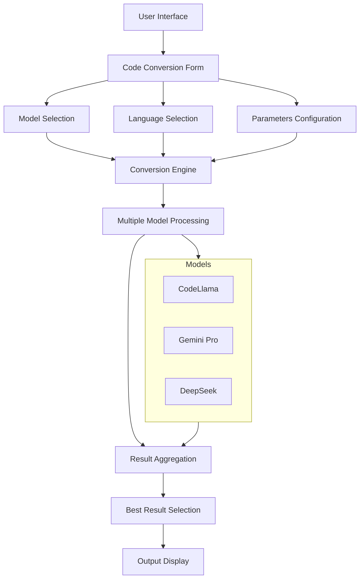
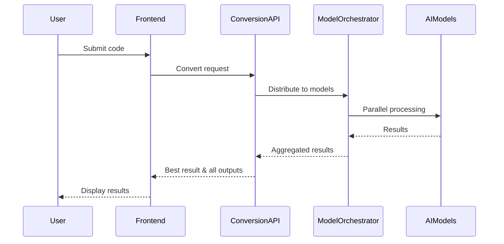

Below is a concise review and flow overview of the “aicodecrat” code conversion tool.

---

### Architectural Overview

• The tool’s front end is React-based, split into modular components under “CodeConversion.”  
• Each component handles a specific concern:  
  – Code display (CodeDisplay, TokenCounter)  
  – Model selection (ModelSelect)  
  – Language picker (LanguageConverter)  
  – Editor integration (CodeEditor)  
  – File import (FileAttachment)  
  – Progress tracking (ConversionProgress)  
  – Conversion settings (ConversionParameters, ComplexitySelector)  
• Constants (constants.ts) handle file extension mappings, accepted extensions, MIME types.  
• Model configurations (models.ts) define available AI models and features.  

---

### High-Level Flow

1. User selects source language, target language, model(s), and sets parameters (temperature, topP, topK, complexity, maxTokens).  
2. User places code either via FileAttachment or typing in CodeEditor.  
3. The ConvertPage collects form data (using React Hook Form), validates it, and triggers conversion requests.  
4. The front end tracks progress (modelProgress) and displays partial or final results in MultiModelOutput and CodeDisplay.  
5. TokenCounter offers awareness of token usage, preventing overly large conversions.  

Diagram sketch (simplified):

```
┌──────────────┐       ┌─────────────────────┐
│ModelSelect   │       │LanguageConverter    │
└──────▲───────┘       └─────────▲───────────┘
       │                         │
       │     ┌─────────────┐    │
       └─────┤ConvertPage  │←───┘
             └──────┬──────┘
   ┌────────────────┼────────────────┐
   │                │                │
   v                v                v
CodeEditor    ConversionParameters  ComplexitySelector
   │                │                │
   └──────────────→ API call →──────┘
         (Conversion logic)
                 ↓
        ┌───────────────────┐
        │MultiModelOutput   │
        └───────────────────┘
                 ↓
          ╔═══════════════╗
          ║CodeDisplay    ║
          ║TokenCounter   ║
          ╚═══════════════╝
```

---

### API & Prompt Technique

• The app typically sends user-selected code, parameters, and model info to an AI inference endpoint (not shown in detail here).  
• Prompting: The “prompt” includes the user’s code, desired language, complexity level, and other parameters (temperature, topP, topK). The AI service responds with a newly generated code snippet.  
• Model fallback: The code references multiple AI models (e.g., “gemini-pro-code,” etc.). If a model fails, the UI can indicate the error; no direct fallback logic is shown beyond letting other chosen models still respond.  

---

### Innovation & Potential

• “aicodecrat” converts source code across languages, supports advanced personalization (complexities, temperature, topK, topP), and tracks token usage.  
• Differentiator: Real-time progress display (ConversionProgress), multi-model outputs (MultiModelOutput), and dynamic parameter control for varying complexities.  
• Potential hackathon idea: Demonstrates robust code transformation with multiple model integration and user-friendly features (upload, token counting, advanced parameter controls).  
• Value Added: Saves developer time, promotes cross-language collaboration, and streamlines code migration tasks.  
• Problem & Opportunity: Many developers struggle with cross-language conversion; aicodecrat lowers those barriers by letting them test and compare conversions quickly.  

---

### Strategic Impact

• Internal/External Benefit: Encourages faster prototyping, smoother migrations, and knowledge transfer between teams using different languages.  
• ROI: Reduced manual rewriting costs, improved code reliability (fewer manual errors), and increased productivity.  
• Innovation Factor: Streamlined multi-model approach combined with advanced prompt controls; minimal direct competition with the same feature set.  
• Unique Problem Addressed: Rapid multi-language transformations, bridging developer language preferences.  
• Unrealized Opportunity: Could expand to specialized frameworks (e.g., Dockerfile, Ansible) and maintain best practices while converting.  

---

Overall, “aicodecrat” showcases a flexible, multi-model, parameter-driven code conversion solution with a strong UI/UX and potential to be pitched at a hackathon or integrated into broader developer workflows.


Let me break down the analysis of aicodecraft systematically.

# Comprehensive Code Analysis

## Architecture Overview


## Core Components

1. **Frontend Components**
   - 

ConvertPage

: Main conversion interface
   - 

ModelSelect

: AI model selection 
   - 

LanguageConverter

: Source/target language selection
   - 

FileAttachment

: Code upload handling
   - 

CodeEditor

: Interactive code editing
   - 

MultiModelOutput

: Parallel model results display

2. **Configuration Layer**
   - Model definitions
   - Language mappings
   - File type handling
   - Token management
   - Progress tracking

## API Architecture



## Key Features and Innovation Points

1. **Multi-Model Processing**
   - Parallel execution across models
   - Intelligent fallback system
   - Best result selection

2. **Advanced Language Support**
   ```typescript
   export const PROGRAMMING_LANGUAGES: Record<string, ProgrammingLanguage> = {
     python: { features: ['Type Hints', 'Async/Await'] },
     javascript: { features: ['ES6+', 'Node.js'] },
     typescript: { features: ['Static Types', 'ES6+'] },
     // ... more languages
   }
   ```

3. **Intelligent Fallback System**
   ```typescript
   export const MODEL_CONFIGS: Record<string, ModelConfig> = {
     "codellama": {
       fallbacks: ["codellama:13b", "codegemma"],
       timeout: 30,
       temperature: 0.7
     }
     // ... more models
   }
   ```

## Innovation Factors

1. **Market Differentiation**
   - Multi-model approach vs single model
   - Parallel processing
   - Intelligent fallback
   - Best result selection

2. **Problem Solving**
   - Code migration complexity
   - Language barrier reduction
   - Quality assurance through multiple models

3. **Strategic Impact**
   - Development time reduction
   - Code quality improvement
   - Cross-platform compatibility

4. **ROI Potential**
   - Developer productivity boost
   - Reduced migration costs
   - Lower error rates

## Prompt Engineering

```typescript
interface PromptTemplate {
  source: string;
  target: string;
  complexity: ComplexityLevel;
  context: string;
}

const generatePrompt = ({source, target, complexity, context}: PromptTemplate) => `
Convert the following ${source} code to ${target}
Complexity level: ${complexity}
Maintain these characteristics:
- Code style and idioms native to ${target}
- Original functionality
- Performance optimization
- Best practices

Context: ${context}
Code:
`
```

## Unique Value Propositions

1. **Quality Assurance**
   - Multiple model validation
   - Best result selection
   - Parallel verification

2. **Flexibility**
   - Multiple language support
   - Customizable parameters
   - File handling options

3. **Enterprise Features**
   - Progress tracking
   - Error handling
   - Token management
   - Download capabilities

## Hackathon Potential

This project has strong hackathon potential due to:

1. **Technical Innovation**
   - Multi-model architecture
   - Parallel processing
   - Intelligent fallback

2. **Clear Problem Statement**
   - Code conversion complexity
   - Language barrier
   - Quality assurance

3. **Measurable Impact**
   - Development speed
   - Code quality
   - Cost reduction

4. **Market Need**
   - Growing multi-language development
   - Legacy code migration
   - Cross-platform development

## Future Enhancements

1. **AI/ML**
   - Model performance tracking
   - Result quality learning
   - Adaptive model selection

2. **Features**
   - More language support
   - Custom model integration
   - Batch processing

3. **Enterprise**
   - Team collaboration
   - Version control
   - API integration

## Code Quality Highlights

```typescript
// Intelligent error handling
const handleModelFailure = async (modelId: string, error: Error) => {
  const config = MODEL_CONFIGS[modelId];
  if (config.fallbacks.length > 0) {
    return await tryFallbackModels(config.fallbacks);
  }
  throw new Error(`All models failed: ${error.message}`);
};
```

This solution stands out for its innovative multi-model approach, robust architecture, and clear focus on solving real development challenges. It's well-suited for hackathon presentation due to its technical depth and clear business value.

Want me to elaborate on any specific aspect?